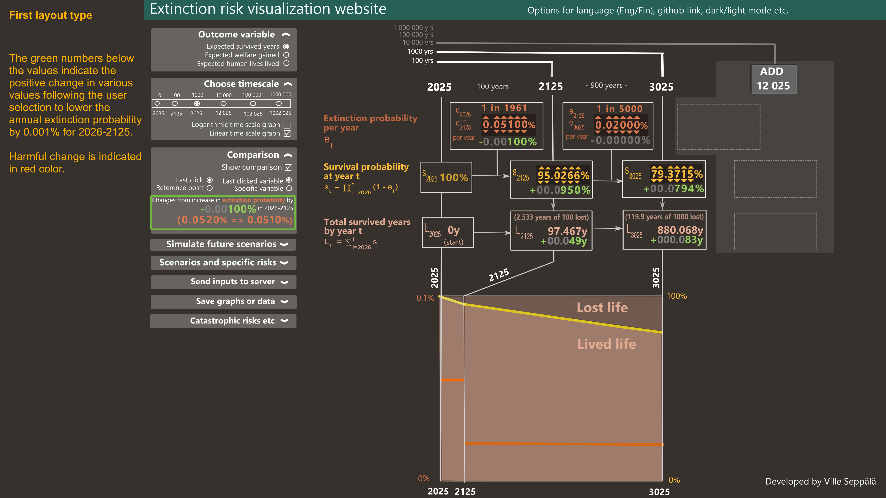
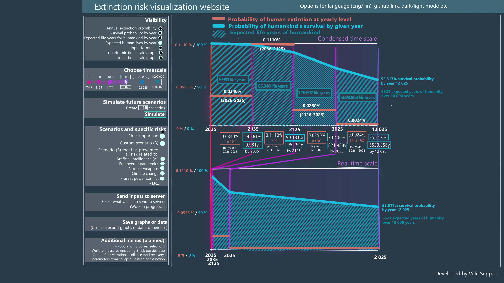

### Abstract and motivation for the site project

I am creating a website that allows the user to input existential risk probabilities for different time periods. The site then calculates the expected longevity of humankind (measured in expected years the humankind will exist or in expected human lives left, for example). Results are also visualized.

The motivation behind the site is to demonstrate, in a concise and easily digestible manner, that even very small improvements in existential risk will pay off immensely in the long run, in terms of humankind’s expected longevity. This should encourage us to pursue these improvements in various ways.

### Layout sketches and prototypes

Layout of the site plays an important role in the site functonality. Below, there are different sketches and prototypes for the layout of the site. I'm not sure yet if I want to focus on any one kind of layout, or develop multiple at one time. This might depend on the time/funding I have to work on the project.





Below are two early, fully interactive version of the site, that I produced with Claude Code. They are still running entirely in browser instead of external server, so the first load takes a few seconds while the R runtime downloads and they might feel a bit sluggish. 

The first one focuses on presenting a lot of variables (inputs/outputs). Click any extinction probability, survival probability or potential-population digit and adjust it with the arrows, arrow keys, or by typing a number.

<!-- XRISK-APP:START -->
```{shinylive-r}
#| standalone: true
#| viewerHeight: 900
# ────────────────────────────────────────────────────────────────────────────
# Extinction-risk visualiser — replica of the right-hand data panel from the
# concept slide. Recomputes the whole cascade in R from the four annual
# extinction rates + population checkpoints, so it also serves as a clean
# recomputation to diff against the slide.
#
# Interaction (JavaScript): click an "Annual extinction probability" cell to
# select a period, then:
#   ← / →  move selection between periods
#   ↑ / ↓  raise / lower that period's annual rate (Shift = fine step)
# The whole table + comparison deltas update live. "Set baseline" freezes the
# current state as the comparison reference; "Reset" restores defaults.
#
# Run:  shiny::runApp("app_xrisk")
# ────────────────────────────────────────────────────────────────────────────

library(shiny)

`%||%` <- function(a, b) if (is.null(a)) b else a

# ── model config ────────────────────────────────────────────────────────────
START     <- 2026
CPS       <- c(2026, 2036, 2126, 3026, 12026)   # checkpoint (column) years
SEG_START <- c(2027, 2037, 2127, 3027)          # first year of each period
SEG_END   <- c(2036, 2126, 3026, 12026)         # last  year of each period
SEG_LEN   <- SEG_END - SEG_START + 1            # 10, 90, 900, 9000
DEF_RATES <- c(0.000340, 0.000510, 0.000250, 0.000024)
POP_CPS   <- rep(8.3e9, 5)                       # constant 8300 M default at every checkpoint
LIFE_EXP  <- 75

YRS_ALL <- START:max(CPS)                        # 2026 .. 12026

# potential population per year: geometric interpolation between the (editable)
# checkpoint values, so the potential-population column stays internally
# consistent — it hits the checkpoint values exactly at the checkpoint years.
build_pop <- function(pop_cps) {
  pop <- numeric(length(YRS_ALL))
  for (k in seq_len(length(CPS) - 1)) {
    y0 <- CPS[k]; y1 <- CPS[k + 1]; v0 <- pop_cps[k]; v1 <- pop_cps[k + 1]
    ix <- which(YRS_ALL >= y0 & YRS_ALL <= y1)
    pop[ix] <- v0 * (v1 / v0) ^ ((YRS_ALL[ix] - y0) / (y1 - y0))
  }
  pop
}

# ── the cascade ─────────────────────────────────────────────────────────────
compute <- function(rates, pop_cps) {
  POP_ALL <- build_pop(pop_cps)
  seg  <- findInterval(YRS_ALL, SEG_START)          # 0 for 2026, else 1..4
  r    <- ifelse(seg >= 1, rates[pmax(seg, 1)], 0)
  surv <- cumprod(1 - r)                             # survival to end of year
  pop_exp <- POP_ALL * surv
  lived   <- seg >= 1                                # years that actually count
  cum_years  <- cumsum(ifelse(lived, surv,    0))
  cum_ly     <- cumsum(ifelse(lived, pop_exp, 0))
  cum_ly_pot <- cumsum(ifelse(lived, POP_ALL, 0))
  ix <- match(CPS, YRS_ALL)
  growth <- c(NA, (pop_cps[-1] / pop_cps[-length(pop_cps)]) ^ (1 / diff(CPS)) - 1)
  list(
    rates      = rates,
    pop_cps    = pop_cps,
    growth     = growth,
    surv       = surv[ix],
    pop_pot    = POP_ALL[ix],
    pop_exp    = pop_exp[ix],
    cum_years  = cum_years[ix],
    cum_ly     = cum_ly[ix],
    cum_ly_pot = cum_ly_pot[ix],
    lives      = cum_ly[ix]     / LIFE_EXP,
    lives_pot  = cum_ly_pot[ix] / LIFE_EXP
  )
}

# ── formatting ──────────────────────────────────────────────────────────────
f_rate  <- function(x) paste0(formatC(x * 100, digits = 4, format = "f"), "%")
f_pct   <- function(x) paste0(formatC(x * 100, digits = 4, format = "f"), "%")
f_int   <- function(x) formatC(round(x), format = "f", digits = 0, big.mark = " ")
f_years <- function(x) paste0(formatC(x, digits = 3, format = "f", big.mark = " "), "y")
f_pop_m <- function(x) paste0(f_int(x / 1e6), "m")
f_ly    <- function(x) paste0(f_int(x), " ly")

# colours
COL_RATE  <- "#e8836f"; COL_SURV <- "#4fb8d6"; COL_POP <- "#e46ba6"
GOOD <- "#7fd18f"; BAD <- "#ee4d4d"; ZERO <- "#8a97a3"

# delta pill: kind = "more_good" (up is green) or "more_bad" (up is red)
fmt_delta <- function(cur, ref, kind, fmt) {
  d <- cur - ref
  if (abs(d) < 1e-9)
    return(span(class = "d0", "±0"))                    # ±0
  good <- (d > 0) == (kind == "more_good")
  sgn  <- if (d > 0) "+" else "−"                       # − for minus
  span(style = paste0("color:", if (good) GOOD else BAD, ";"),
       paste0(sgn, fmt(abs(d))))
}

# plain (non-editable) value cell on the grid (spans 2 half-columns)
gcell <- function(col, main, delta = NULL, sub = NULL, color = "#e8eef4") {
  tags$div(class = "vcell", style = paste0("grid-column:", col, "/span 2;"),
    div(class = "vstack",
      div(class = "vmain", style = paste0("color:", color, ";"), HTML(main)),
      if (!is.null(delta)) div(class = "vdelta", delta)),
    if (!is.null(sub)) div(class = "vsub", HTML(sub)))
}

# insert thin-space thousands separators into a plain digit string
group3 <- function(s) {
  ch <- rev(strsplit(s, "")[[1]]); out <- character(0)
  for (i in seq_along(ch)) { if (i > 1 && (i - 1) %% 3 == 0) out <- c(out, " "); out <- c(out, ch[i]) }
  paste(rev(out), collapse = "")
}

# build digit slots for a number — used for both the value and its (editable) delta.
#   native      : native value; abs() is shown, sign handled via sign_char
#   to_disp     : multiplier to display units (rate 100 → %, pop 1/1e6 → m)
#   decimals    : decimal places in display units
#   pad         : if set, always show this many integer digits (leading zeros greyed
#                 but still adjustable — lets the user ramp big places fast)
#   digit_color : function(is_zero, is_lead) -> CSS colour or NULL (inherit)
#   sign_char/sign_color : optional leading sign slot (for deltas)
build_slots <- function(native, to_disp, decimals, suffix, pad = NULL, editable = TRUE,
                        digit_color = NULL, sign_char = NULL, sign_color = NULL) {
  a <- abs(native)
  if (!is.null(pad))
    s <- group3(formatC(round(a * to_disp), format = "d", width = pad, flag = "0"))
  else
    s <- formatC(a * to_disp, format = "f", digits = decimals, big.mark = " ")
  chars <- strsplit(s, "")[[1]]
  n     <- length(chars)
  dot   <- match(".", chars); if (is.na(dot)) dot <- n + 1
  place <- rep(NA_real_, n)
  k <- 0                                            # integer digits, right → left
  for (p in seq(dot - 1, 1)) {
    if (grepl("[0-9]", chars[p])) { place[p] <- (10^k) / to_disp; k <- k + 1 }
  }
  if (dot < n) {                                    # decimal digits, left → right
    kk <- 1
    for (p in seq(dot + 1, n)) {
      if (grepl("[0-9]", chars[p])) { place[p] <- (10^(-kk)) / to_disp; kk <- kk + 1 }
    }
  }
  lead <- rep(FALSE, n)                             # zeros before the first significant digit
  seen <- FALSE
  for (p in seq_len(n)) if (grepl("[0-9]", chars[p])) {
    if (!seen && chars[p] == "0") lead[p] <- TRUE else seen <- TRUE
  }
  mkslot <- function(p) {
    ch <- chars[p]
    if (!is.na(place[p])) {
      col <- if (!is.null(digit_color)) digit_color(ch == "0", lead[p])
             else if (!is.null(pad) && lead[p]) "#5f7484" else NULL
      tags$span(class = "dig", `data-delta` = formatC(place[p], format = "e", digits = 6),
        if (editable) span(class = "ar up", HTML("&#9650;")) else span(class = "arsp"),
        tags$b(class = "dch", style = if (!is.null(col)) paste0("color:", col, ";"), ch),
        if (editable) span(class = "ar dn", HTML("&#9660;")) else span(class = "arsp"))
    } else
      tags$span(class = "sep", span(class = "arsp"),
        tags$b(class = "dch", if (ch == " ") HTML("&nbsp;") else ch), span(class = "arsp"))
  }
  slots <- lapply(seq_len(n), mkslot)
  if (!is.null(sign_char))
    slots <- c(list(tags$span(class = "sep", span(class = "arsp"),
      tags$b(class = "dch sgn", style = if (!is.null(sign_color)) paste0("color:", sign_color, ";"),
             HTML(sign_char)), span(class = "arsp"))), slots)
  if (nzchar(suffix))
    slots <- c(slots, list(tags$span(class = "sep", span(class = "arsp"),
      tags$b(class = "dch suf", HTML(suffix)), span(class = "arsp"))))
  slots
}

# editable value cell: per-digit spinner
gcell_edit <- function(col, cur, ref, kind, vi, to_disp, decimals, suffix,
                       good = "more_good", sub = NULL, color, pad = NULL, top = NULL) {
  dv   <- cur - ref
  cpos <- if (good == "more_good") GOOD else BAD    # colour when delta positive
  cneg <- if (good == "more_good") BAD  else GOOD
  dcol <- if (abs(dv) < 1e-12) ZERO else if (dv > 0) cpos else cneg
  sgn  <- if (abs(dv) < 1e-12) "±" else if (dv > 0) "+" else "−"
  digit_color <- function(is0, lead) if (lead) ZERO else dcol
  tags$div(class = "vcell xedit", style = paste0("grid-column:", col, "/span 2;"),
    `data-kind` = kind, `data-i` = vi - 1,
    if (!is.null(top)) div(class = "vtop", HTML(top)),
    div(class = "vstack",
      div(class = "vmain digits", style = paste0("color:", color, ";"),
          build_slots(cur, to_disp, decimals, suffix, pad, TRUE)),
      div(class = "vdelta digits",
          build_slots(dv, to_disp, decimals, suffix, pad, TRUE,
                      digit_color = digit_color, sign_char = sgn, sign_color = dcol))),
    if (!is.null(sub)) div(class = "vsub", HTML(sub)))
}

# a full metric row (label in column 1, then its value cells).
# cls = "erow" tints the whole row (label included) to flag it as editable.
# row = id used by the accordion toggle to collapse/expand this row.
metric_grow <- function(label, color, cells, cls = NULL, row = NULL, formula = NULL)
  do.call(tags$div, c(list(class = trimws(paste("grow", cls %||% "")), `data-row` = row,
    tags$div(class = "rlabel", style = paste0("color:", color, ";"),
      span(class = "acc", HTML("&#9662;")), span(class = "rlbl", HTML(label)),
      if (!is.null(formula)) div(class = "rformula", HTML(formula)))),
    cells))

# ── UI ──────────────────────────────────────────────────────────────────────
css <- r"(
body{background:#0b3552;color:#e8eef4;font-family:Arial,Helvetica,sans-serif;margin:0;}
.wrap{max-width:1240px;margin:0 auto;padding:18px 22px 70px;}
h1{font-size:21px;font-weight:700;margin:0 0 4px;}
.lead{font-size:13px;color:#b7c6d3;margin:0 0 14px;line-height:1.5;}
.controls{display:flex;gap:10px;align-items:center;margin:12px 0 20px;flex-wrap:wrap;}
.controls .btn{background:#12405f;color:#e8eef4;border:1px solid #2a6a8f;border-radius:6px;
  padding:6px 13px;font-size:13px;cursor:pointer;}
.controls .btn:hover{background:#175981;}
.controls .btn.active{background:#1f77a8;border-color:#8fd6f2;color:#fff;box-shadow:0 0 0 1px #8fd6f2 inset;}
.khint{font-size:12.5px;color:#9fb0bf;}
.kbd{display:inline-block;background:#0a2438;border:1px solid #2a6a8f;border-radius:4px;
  padding:0 7px;font-size:12px;margin:0 1px;line-height:18px;}
.grid-wrap{margin-top:4px;}
.grow{display:grid;grid-template-columns:200px repeat(10,1fr);align-items:start;
  border-bottom:1px solid rgba(255,255,255,.05);}
.grow.ghead{border-bottom:1px solid rgba(255,255,255,.18);}
.grow.erow{background:rgba(255,255,255,.05);border-radius:7px;margin:3px 0;}
.rlabel{grid-column:1;text-align:left;font-size:12.5px;line-height:1.35;font-weight:600;
  padding:9px 12px 9px 0;border-right:1px solid rgba(255,255,255,.10);}
.acc{cursor:pointer;color:#8fa3b3;font-size:10px;margin-right:6px;display:inline-block;user-select:none;}
.acc:hover{color:#ffd27f;}
.grow.collapsed .acc{transform:rotate(-90deg);}
.grow.collapsed .vcell{display:none;}
.grow.collapsed .rformula{display:none;}
.grow.collapsed{margin:1px 0;}
.rformula{font-size:12px;color:#cbb68e;margin-top:4px;padding-left:16px;font-weight:400;
  line-height:1.6;font-family:Cambria,Georgia,"Times New Roman",serif;font-style:italic;}
.rformula sub{font-size:8.5px;font-style:normal;}
.rformula sup{font-size:8.5px;font-style:normal;}
.ycol{text-align:center;padding:2px 6px 7px;}
.ycol .yr{font-size:21px;font-weight:700;}
.ivlcell{text-align:center;font-size:11px;color:#9fb0bf;padding:3px 4px;align-self:center;
  white-space:nowrap;}
.vcell{grid-row:1;padding:8px 7px;display:flex;flex-direction:column;align-items:center;text-align:center;}
.vstack{display:inline-flex;flex-direction:column;align-items:stretch;}
.vmain{font-size:15px;line-height:1.2;font-weight:700;word-break:break-word;font-variant-numeric:tabular-nums;text-align:right;}
.vmain .per{font-size:10px;color:#9fb0bf;font-weight:400;}
.vdelta{font-size:15px;margin-top:1px;font-weight:600;font-variant-numeric:tabular-nums;text-align:right;line-height:1.15;}
.vdelta .d0{color:#8a97a3;}
.vsub{font-size:11px;color:#8496a4;margin-top:3px;font-style:italic;line-height:1.35;}
.vgrowth{grid-row:1;align-self:start;margin-top:22px;text-align:center;font-size:12px;color:#8496a4;
  font-style:italic;white-space:nowrap;padding:0 3px;pointer-events:none;}
@media (max-width:860px){ .vgrowth{grid-row:auto;margin-top:3px;} }  /* narrow: drop below, no overlap */
.grow.collapsed .vgrowth{display:none;}
.ratio{color:#e8836f;font-size:13px;font-weight:600;font-style:normal;}
.rng{font-size:12px;font-style:italic;color:#8496a4;}
.vtop{line-height:1.1;margin-bottom:1px;}
.ital{font-style:italic;font-weight:400;opacity:.85;}
.digits{display:flex;justify-content:flex-end;align-items:flex-end;flex-wrap:nowrap;}
.dig,.sep{display:flex;flex-direction:column;align-items:center;line-height:1;}
.dig{width:1ch;}                 /* digit width fixed; larger arrows overflow it */
.dch{font-size:15px;font-weight:700;font-variant-numeric:tabular-nums;padding:0;}
.dch.suf{color:#9fb0bf;}
.dig.lead .dch{color:#5f7484;}
.ar{cursor:pointer;font-size:11px;color:#5f7484;user-select:none;height:13px;line-height:13px;padding:0;}
.ar:hover{color:#ffd27f;}
.arsp{height:13px;}
.dig.digsel .dch{color:#ffd27f !important;}
.dig.digsel .ar{color:#e8b96a;}
.xedit{cursor:pointer;border-radius:6px;}
.xedit:hover{background:rgba(255,255,255,.045);}
.xedit.sel{outline:2px solid rgba(255,210,127,.55);outline-offset:-2px;background:rgba(255,210,127,.06);}
.summary{margin:18px 0 0;font-size:13px;color:#cdd9e3;line-height:1.55;
  border-top:1px solid rgba(255,255,255,.10);padding-top:12px;}
.summary b{color:#ffd27f;}
.foot{margin-top:22px;font-size:11.5px;color:#7d8fa0;line-height:1.5;}
)"

js <- r"(
var rates = [0.000340, 0.000510, 0.000250, 0.000024];
var pops  = [8.3e9, 8.3e9, 8.3e9, 8.3e9, 8.3e9];
var LEN   = [10, 90, 900, 9000];                 // interval lengths (years)
var baseRates = rates.slice(), basePops = pops.slice();   // comparison baseline (from server)
var sel   = {kind:'rate', i:1, place:0.00001, delta:false};  // value/delta + which digit
function pushState(){ if(window.Shiny) Shiny.setInputValue('state', {rates:rates, pops:pops}, {priority:'event'}); }
function cellOf(s){ return document.querySelector('.xedit[data-kind="'+s.kind+'"][data-i="'+s.i+'"]'); }
function digsOf(c){ if(!c) return []; return Array.prototype.slice.call(c.querySelectorAll((sel.delta ? '.vdelta' : '.vmain') + ' .dig')); }
function allCells(){ return Array.prototype.slice.call(document.querySelectorAll('.xedit')); }
function digDelta(el){ return parseFloat(el.getAttribute('data-delta')); }
function nearestDig(digs, place){                // match a digit by its place value
  var best = 0, bd = Infinity;
  for(var k = 0; k < digs.length; k++){
    var d = Math.abs(Math.log(digDelta(digs[k])) - Math.log(place));
    if(d < bd){ bd = d; best = k; }
  }
  return best;
}
function applyHighlight(){
  allCells().forEach(function(c){
    var on = c.getAttribute('data-kind') === sel.kind && (+c.getAttribute('data-i')) === sel.i;
    c.classList.toggle('sel', on);
    c.querySelectorAll('.dig').forEach(function(d){ d.classList.remove('digsel'); });
    if(on){
      var digs = digsOf(c);
      if(digs.length){
        var idx = nearestDig(digs, sel.place);
        digs[idx].classList.add('digsel');
        sel.place = digDelta(digs[idx]);         // snap to an existing digit
      }
    }
  });
}
function survOf(arr, i){                          // cumulative survival through interval i
  var p = 1; for(var k = 0; k <= i; k++) p *= Math.pow(1 - arr[k], LEN[k]); return p;
}
// set survival at checkpoint i to target T by solving the interval-i extinction
// rate, backtracing into earlier intervals when T exceeds the prior survival.
function setSurv(i, T){
  T = Math.min(1, Math.max(0, T));               // 100% ceiling, 0 floor
  for(var m = i; m >= 0; m--){
    var Pprev = 1; for(var k = 0; k < m; k++) Pprev *= Math.pow(1 - rates[k], LEN[k]);
    var needed = T / Pprev;                       // desired (1-r_m)^len_m
    if(needed <= 1){ rates[m] = 1 - Math.pow(needed, 1 / LEN[m]); break; }
    rates[m] = 0;                                 // maxed this interval, keep backtracing
  }
  pushState();
}
var MINPLACE = { rate:1e-6, surv:1e-6, pop:1e6 };  // smallest editable digit per kind
function valOf(kind, i, rArr, pArr){ return kind === 'surv' ? survOf(rArr, i) : (kind === 'rate' ? rArr : pArr)[i]; }
function curVal(){  return valOf(sel.kind, sel.i, rates, pops); }
function baseVal(){ return valOf(sel.kind, sel.i, baseRates, basePops); }
function setValAbs(v){                            // write the actual value (backtrace for surv)
  if(sel.kind === 'surv'){ setSurv(sel.i, v); }
  else { var arr = (sel.kind === 'rate') ? rates : pops; arr[sel.i] = Math.max(0, +v.toFixed(12)); pushState(); }
}
// when sel.delta, we edit the change (value − baseline); otherwise the value itself
function editVal(){ return sel.delta ? (curVal() - baseVal()) : curVal(); }
function applyEdit(nv){ setValAbs(sel.delta ? baseVal() + nv : nv); }
function change(dir){                             // ▼ always lowers, ▲ always raises (monotonic)
  applyEdit(editVal() + dir * sel.place);         // crosses zero once, never flip-flops
}
// type a digit into the selected place (selection stays put)
function typeDigit(d){
  var place = sel.place, v = editVal(), av = Math.abs(v), sign = v < 0 ? -1 : 1;
  var cd = Math.floor(av / place + 1e-6) % 10;      // current digit at this place
  applyEdit(sign * (av + (d - cd) * place));
}
document.addEventListener('keydown', function(e){
  var k = e.key;
  if(/^[0-9]$/.test(k)){ e.preventDefault(); typeDigit(+k); return; }
  if(['ArrowUp','ArrowDown','ArrowLeft','ArrowRight'].indexOf(k) < 0) return;
  e.preventDefault();
  if(k === 'ArrowUp')   { change(1);  return; }
  if(k === 'ArrowDown') { change(-1); return; }
  var cells = allCells(), cell = cellOf(sel); if(!cell) return;
  var digs = digsOf(cell), idx = nearestDig(digs, sel.place), ci = cells.indexOf(cell);
  if(k === 'ArrowRight'){
    if(idx < digs.length - 1) sel.place = digDelta(digs[idx + 1]);
    else if(ci < cells.length - 1){ var nc = cells[ci + 1], nd = digsOf(nc);
      sel = {kind:nc.getAttribute('data-kind'), i:+nc.getAttribute('data-i'), place:digDelta(nd[0]), delta:sel.delta}; }
  } else {                                         // ArrowLeft
    if(idx > 0) sel.place = digDelta(digs[idx - 1]);
    else if(ci > 0){ var pc = cells[ci - 1], pd = digsOf(pc);
      sel = {kind:pc.getAttribute('data-kind'), i:+pc.getAttribute('data-i'), place:digDelta(pd[pd.length - 1]), delta:sel.delta}; }
  }
  applyHighlight();
});
document.addEventListener('click', function(e){
  var cell = e.target.closest('.xedit'); if(!cell) return;
  var dig  = e.target.closest('.dig');
  if(dig){
    sel = {kind:cell.getAttribute('data-kind'), i:+cell.getAttribute('data-i'),
           place:digDelta(dig), delta: !!dig.closest('.vdelta')};
    var up = e.target.closest('.ar.up'), dn = e.target.closest('.ar.dn');
    if(up || dn){ change(up ? 1 : -1); return; }
    applyHighlight();
  } else {
    sel.kind = cell.getAttribute('data-kind'); sel.i = +cell.getAttribute('data-i'); sel.delta = false;
    applyHighlight();
  }
});
// mouse wheel over a digit nudges that digit (up = raise, down = lower).
// Accumulate delta and step per threshold so a touchpad gesture (many events +
// inertia) doesn't run the digit away — ~one step per notch / firm swipe.
var wheelAcc = 0;
document.addEventListener('wheel', function(e){
  var dig = e.target.closest('.dig'); if(!dig){ wheelAcc = 0; return; }
  var cell = dig.closest('.xedit'); if(!cell){ wheelAcc = 0; return; }
  e.preventDefault();
  var d = e.deltaY;
  if(e.deltaMode === 1) d *= 33; else if(e.deltaMode === 2) d *= 400;   // lines/pages → px
  if(wheelAcc !== 0 && (d < 0) !== (wheelAcc < 0)) wheelAcc = 0;         // direction flip → reset
  wheelAcc += d;
  var STEP = 90;
  if(Math.abs(wheelAcc) < STEP) return;
  sel = {kind:cell.getAttribute('data-kind'), i:+cell.getAttribute('data-i'),
         place:digDelta(dig), delta: !!dig.closest('.vdelta')};
  var n = 0;
  while(wheelAcc <= -STEP && n < 8){ wheelAcc += STEP; change(1);  n++; }
  while(wheelAcc >=  STEP && n < 8){ wheelAcc -= STEP; change(-1); n++; }
  if(n >= 8) wheelAcc = 0;   // guard against a pathological single event
}, {passive:false});
var collapsed = {};                              // row id -> hidden?
function applyCollapsed(){
  document.querySelectorAll('.grow[data-row]').forEach(function(g){
    g.classList.toggle('collapsed', !!collapsed[g.getAttribute('data-row')]);
  });
}
document.addEventListener('click', function(e){
  var acc = e.target.closest('.acc'); if(!acc) return;
  var g = acc.closest('.grow'); if(!g) return;
  var r = g.getAttribute('data-row'); collapsed[r] = !collapsed[r]; applyCollapsed();
});
$(document).on('shiny:value', function(ev){ if(ev.name === 'panel') setTimeout(function(){ applyHighlight(); applyCollapsed(); }, 0); });
$(document).on('shiny:connected', function(){ pushState(); setTimeout(function(){ applyHighlight(); applyCollapsed(); }, 60); });
if(window.Shiny){
  Shiny.addCustomMessageHandler('setState', function(v){
    rates = v.rates.slice(); pops = v.pops.slice(); pushState(); applyHighlight();
  });
  Shiny.addCustomMessageHandler('baseline', function(v){
    baseRates = v.rates.slice(); basePops = v.pops.slice();
  });
}
)"

ui <- fluidPage(
  tags$head(tags$style(HTML(css))),
  div(class = "wrap",
    h1("Expected longevity of humanity under extinction risk"),
    p(class = "lead",
      "Each period's annual extinction probability cascades into survival ",
      "probability, expected population, and cumulative human life lived. ",
      "Deltas compare against the frozen baseline."),
    div(class = "controls",
      actionButton("surv100", "100% survival", class = "btn"),
      uiOutput("basebtns", inline = TRUE),
      actionButton("reset", "Reset to defaults", class = "btn"),
      span(class = "khint", HTML(
        "Edit any <b>extinction probability</b>, <b>survival probability</b>, or ",
        "<b>potential population</b> digit &mdash; click its ",
        "<span class='kbd'>&#9650;</span>/<span class='kbd'>&#9660;</span>, or select and use ",
        "<span class='kbd'>&larr;</span><span class='kbd'>&rarr;</span><span class='kbd'>&uarr;</span><span class='kbd'>&darr;</span>, ",
        "or type <span class='kbd'>0</span>&ndash;<span class='kbd'>9</span> to set the digit. ",
        "Survival edits backtrace into the earlier extinction rates."))),
    uiOutput("panel"),
    uiOutput("summary"),
    div(class = "foot", HTML(
      "Potential population is interpolated geometrically between the ",
      "checkpoints 8.2 / 8.9 / 10 / 10 / 10&nbsp;bn, so it stays internally ",
      "consistent. Lives = cumulative life-years &divide; 75.")),
    tags$script(HTML(js)))
)

# ── server ──────────────────────────────────────────────────────────────────
server <- function(input, output, session) {

  DEF_STATE <- list(rates = DEF_RATES, pops = POP_CPS)
  state_r <- reactive({
    s <- input$state
    if (is.null(s)) DEF_STATE
    else            list(rates = as.numeric(s$rates), pops = as.numeric(s$pops))
  })

  mode       <- reactiveVal("current")           # "current" | "previous"
  ref_static <- reactiveVal(DEF_STATE)            # frozen baseline (current mode)
  hist       <- reactiveValues(prev = DEF_STATE, last = DEF_STATE)

  # remember the state before the most recent change
  observeEvent(input$state, {
    hist$prev <- hist$last
    hist$last <- state_r()
  })

  ref_state <- reactive(if (mode() == "previous") hist$prev else ref_static())

  observe({                                        # keep JS informed of the baseline (for delta editing)
    b <- ref_state()
    session$sendCustomMessage("baseline",
      list(rates = as.numeric(b$rates), pops = as.numeric(b$pops)))
  })

  observeEvent(input$setref,  { ref_static(state_r()); mode("current") })
  observeEvent(input$setprev, mode("previous"))
  observeEvent(input$surv100, {                   # all survival → 100%, all x-risk → 0; rebase deltas to 0
    new_state <- list(rates = as.numeric(c(0, 0, 0, 0)), pops = as.numeric(state_r()$pops))
    session$sendCustomMessage("setState", new_state)
    ref_static(new_state); mode("current")
  })
  observeEvent(input$reset, {
    session$sendCustomMessage("setState",
      list(rates = as.numeric(DEF_RATES), pops = as.numeric(POP_CPS)))
    ref_static(DEF_STATE); hist$prev <- DEF_STATE; hist$last <- DEF_STATE
    mode("current")
  })

  output$basebtns <- renderUI({
    m <- mode()
    tagList(
      actionButton("setref",  "Set baseline = current",
                   class = if (m == "current")  "btn active" else "btn"),
      actionButton("setprev", "Set baseline = previous value",
                   class = if (m == "previous") "btn active" else "btn"))
  })

  output$panel <- renderUI({
    st  <- state_r(); rf <- ref_state()
    cur <- compute(st$rates, st$pops)
    ref <- compute(rf$rates, rf$pops)
    elapsed <- c(0, cumsum(SEG_LEN))                 # 0,10,100,1000,10000
    ycol <- function(j) 2 * j                         # grid start for year j
    gcol <- function(i) 2 * i + 1                     # grid start for gap i (between year i & i+1)

    # header: years centered over their columns
    header <- do.call(tags$div, c(list(class = "grow ghead",
      tags$div(class = "rlabel", "")),
      lapply(1:5, function(j)
        tags$div(class = "ycol", style = paste0("grid-column:", ycol(j), "/span 2;"),
          div(class = "yr", CPS[j])))))

    # interval row: "← N years →" centered in each gap
    intervals <- do.call(tags$div, c(list(class = "grow",
      tags$div(class = "rlabel", "")),
      lapply(1:4, function(i)
        tags$div(class = "ivlcell", style = paste0("grid-column:", gcol(i), "/span 2;"),
          HTML(paste0("&larr; ", SEG_LEN[i], " years &rarr;"))))))

    # 1 · annual extinction probability — editable, sits in the gaps between years
    rate_cells <- lapply(1:4, function(i)
      gcell_edit(gcol(i), cur = cur$rates[i], ref = ref$rates[i], kind = "rate", vi = i,
        to_disp = 100, decimals = 4, suffix = "%", good = "more_bad",
        top   = paste0("<span class='ratio'>1 in ", f_int(1 / cur$rates[i]), "</span>"),
        sub   = paste0("<span class='rng'>", SEG_START[i], "&ndash;", SEG_END[i], "</span>"),
        color = COL_RATE))

    # 2 · survival probability given past extinction — editable (backtraces to rates)
    surv_cells <- lapply(1:5, function(j) {
      if (j == 1)                                     # 2026 is fixed at 100%
        return(gcell(ycol(1), f_pct(cur$surv[1]), color = COL_SURV))
      gcell_edit(ycol(j), cur = cur$surv[j], ref = ref$surv[j], kind = "surv", vi = j - 1,
        to_disp = 100, decimals = 4, suffix = "%", good = "more_good",
        color = COL_SURV)
    })

    # 3 · cumulative survived years of humanity
    years_cells <- lapply(1:5, function(j)
      gcell(ycol(j), if (j == 1) "0" else f_years(cur$cum_years[j]),
        if (j == 1) NULL else fmt_delta(cur$cum_years[j], ref$cum_years[j], "more_good", f_years),
        if (j == 1) NULL else paste0("of ", f_int(elapsed[j]), "y potential"),
        color = COL_SURV))

    # 4 · potential population if survived — editable checkpoints
    pop_pot_cells <- lapply(1:5, function(j)
      gcell_edit(ycol(j), cur = cur$pop_pot[j], ref = ref$pop_pot[j], kind = "pop", vi = j,
        to_disp = 1 / 1e6, decimals = 0, suffix = "m", pad = 5, good = "more_good",
        color = COL_POP))
    # per-period growth rate sits in the gap between the two checkpoints it spans
    growth_cells <- lapply(1:4, function(i) {
      g <- cur$growth[i + 1] * 100
      tags$div(class = "vgrowth", style = paste0("grid-column:", gcol(i), "/span 2;"),
        HTML(paste0(if (g >= 0) "+" else "", formatC(g, digits = 3, format = "f"), "%/yr")))
    })

    # 5 · expected population with survival probabilities
    pop_exp_cells <- lapply(1:5, function(j)
      gcell(ycol(j), f_int(cur$pop_exp[j]),
        if (j == 1) NULL else fmt_delta(cur$pop_exp[j], ref$pop_exp[j], "more_good", f_int),
        if (j == 1) NULL else paste0("of ", f_int(cur$pop_pot[j]), " potential"),
        color = COL_POP))

    # 6 · expected cumulative lived human life-years
    ly_cells <- lapply(1:5, function(j)
      gcell(ycol(j), if (j == 1) "0" else paste0(f_int(cur$cum_ly[j]), " ly"),
        if (j == 1) NULL else fmt_delta(cur$cum_ly[j], ref$cum_ly[j], "more_good", f_ly),
        if (j == 1) NULL else paste0("of ", f_int(cur$cum_ly_pot[j]), " potential"),
        color = COL_POP))

    # 7 · expected cumulative lived human lives (75y)
    lives_cells <- lapply(1:5, function(j)
      gcell(ycol(j), if (j == 1) "0" else f_int(cur$lives[j]),
        if (j == 1) NULL else fmt_delta(cur$lives[j], ref$lives[j], "more_good", f_int),
        if (j == 1) NULL else paste0(f_int(cur$lives_pot[j] - cur$lives[j]), " less than potential"),
        color = COL_POP))

    div(class = "grid-wrap",
      header,
      intervals,
      metric_grow("Annual extinction<br>probability <span class='ital'>if survived</span>",  COL_RATE, rate_cells,    cls = "erow", row = "rate",
                  formula = "e<sub>t</sub>"),
      metric_grow("Survival probability<br><span class='ital'>given past extinction</span>",  COL_SURV, surv_cells,    cls = "erow", row = "surv",
                  formula = "s<sub>t</sub> = &prod;<sub>i=2027</sub><sup>t</sup> (1 &minus; e<sub>i</sub>)"),
      metric_grow("Cumulative survived<br>years of humanity",                                 COL_SURV, years_cells,   row = "years",
                  formula = "L<sub>t</sub> = &sum;<sub>i=2027</sub><sup>t</sup> s<sub>i</sub>"),
      metric_grow("Potential population<br><span class='ital'>if survived</span>",            COL_POP,  c(pop_pot_cells, growth_cells), cls = "erow", row = "pop",
                  formula = "P<sub>t</sub>"),
      metric_grow("Expected population<br><span class='ital'>with survival prob.</span>",     COL_POP,  pop_exp_cells, row = "popexp",
                  formula = "E<sub>t</sub> = P<sub>t</sub> &middot; s<sub>t</sub>"),
      metric_grow("Expected cumulative<br>lived human life-years",                            COL_POP,  ly_cells,      row = "ly",
                  formula = "H<sub>t</sub> = &sum;<sub>i=2027</sub><sup>t</sup> E<sub>i</sub>"),
      metric_grow("Expected cumulative<br>lived human lives <span class='ital'>(75y)</span>", COL_POP,  lives_cells,   row = "lives",
                  formula = "N<sub>t</sub> = H<sub>t</sub> / 75"))
  })

  output$summary <- renderUI({
    st  <- state_r()
    cur <- compute(st$rates, st$pops)
    div(class = "summary", HTML(paste0(
      "With these rates, humanity survives to <b>", max(CPS),
      "</b> with <b>", f_pct(cur$surv[5]), "</b> probability, is expected to live ",
      "<b>", f_years(cur$cum_years[5]), "</b> of the next ",
      f_int(sum(SEG_LEN)), " years, and to accrue <b>", f_int(cur$lives[5]),
      "</b> human lives (", f_int(cur$cum_ly[5]), " life-years).")))
  })
}

shinyApp(ui, server)
```
<!-- XRISK-APP:END -->

### Threshold curve editor

Below is an alternative prototype where you sketch the whole risk profile as a curve rather than typing numbers. Drag the red **extinction-probability-per-year** handles or the blue population handles across the timeline (years 0–1110 over three log-spaced spans). This allows more customizability on what x-risk probabilities the user sets for which time period. 

<!-- HAZARD-APP:START -->
```{shinylive-r}
#| standalone: true
#| viewerHeight: 900
# ============================================================================
# Shiny — hazard/survival threshold controls (value-space, bidirectional).
# ----------------------------------------------------------------------------
# Curve interpolated in VALUE space (cubic Hermite on value vs fx), mapped
# through the y-axis for drawing, so it bends where it crosses a decade band.
#
# Two control sets, one authoritative at a time ("driver"):
#   * Hazard set (red): anchors value+slope, per-segment controls -> hazard(fx),
#     survival derived by S=prod(1-h)^dy.
#   * Survival set (blue): same handles on the survival curve -> survival(fx),
#     hazard derived by h = 1 - (S_i/S_{i-1})^(1/dy).
# Grabbing a handle makes its set the driver; the other set is greyed and just
# tracks the derived curve.  Default hazard peaks around year 20.
#
# Run:  shiny::runApp("hazard_thresholds.R")
# ============================================================================

required <- c("shiny", "ggplot2")
missing  <- required[!vapply(required, requireNamespace, logical(1), quietly = TRUE)]
if (length(missing)) install.packages(missing)

library(shiny)
library(ggplot2)

## ---- constants + shared helpers -------------------------------------------
SPANX <- c(10, 100, 1000); M <- 100; Wpx <- 1240; Hpx <- 698   # 16:9, width matches x-risk app

haz_to_fy <- function(h) {
  h <- pmin(1e-1, pmax(1e-5, h)); d <- floor(log10(h)); seg <- pmin(3, pmax(0, d + 5))
  lo <- 10^(seg-5); hi <- 10^(seg-4); (seg + pmin(1, pmax(0, (h-lo)/(hi-lo)))) / 4
}
fit_linexp <- function(mx) max(-5, min(-1, floor(log10(mx)) + 1))
herm <- function(px, x0, y0, m0, x1, y1, m1) {
  h <- x1 - x0; u <- (px-x0)/h
  y0*(2*u^3-3*u^2+1) + m0*h*(u^3-2*u^2+u) + y1*(-2*u^3+3*u^2) + m1*h*(u^3-u^2)
}
default_atheta <- function(anchors) {
  fy <- haz_to_fy(anchors); px <- (0:3)/3*Wpx; py <- (1-fy)*Hpx; th <- numeric(4)
  for (i in 1:4) { lo <- max(1,i-1); hi <- min(4,i+1); th[i] <- atan2(py[hi]-py[lo], px[hi]-px[lo]) }
  th
}
sample_set <- function(anchors, thetaL, thetaR, fxc, cval, useCtrl, dYdv, clampV, log_time = FALSE) {
  tfrac <- function(u) if (log_time) (10^u - 1) / 9 else u   # log: single decade of time per span
  rows <- list()
  for (s in 1:3) {
    fxL <- (s-1)/3; fxR <- s/3; hL <- anchors[s]; hR <- anchors[s+1]
    mL <- tan(thetaR[s])*Wpx/dYdv(hL); mR <- tan(thetaL[s+1])*Wpx/dYdv(hR); mC <- (hR-hL)/(fxR-fxL)
    fxC <- fxc[s]; hC <- cval[s]; ms <- if (s==1) 0:M else 1:M; fx <- fxL + (ms/M)*(fxR-fxL)
    u <- ms/M; dy <- SPANX[s] * (tfrac(u) - tfrac(u - 1/M))   # years covered by each sample
    v <- if (useCtrl) ifelse(fx<=fxC, herm(fx,fxL,hL,mL,fxC,hC,mC), herm(fx,fxC,hC,mC,fxR,hR,mR))
         else herm(fx,fxL,hL,mL,fxR,hR,mR)
    rows[[s]] <- data.frame(fx = fx, val = clampV(v), dy = dy)
  }
  do.call(rbind, rows)
}
haz_dYdv <- function(h, lm, linearY) {
  if (linearY) return(-Hpx/lm)
  h <- pmin(1e-1, pmax(1e-5, h)); seg <- pmin(3, pmax(0, floor(log10(h))+5))
  lo <- 10^(seg-5); hi <- 10^(seg-4); -(Hpx/4)/(hi-lo)
}
compute_both <- function(hz, sv, driver, useCtrl, linearY, log_time = FALSE) {
  if (driver == "hazard") {
    lm <- if (linearY) 10^fit_linexp(max(hz$anchors)) else 1
    hs <- sample_set(hz$anchors, hz$thetaL, hz$thetaR, hz$fxc, hz$cval, useCtrl,
                     function(h) haz_dYdv(h, lm, linearY), function(v) pmin(1e-1, pmax(1e-5, v)), log_time)
    surv <- cumprod((1 - hs$val)^hs$dy)
  } else {
    ss <- sample_set(sv$anchors, sv$thetaL, sv$thetaR, sv$fxc, sv$cval, useCtrl,
                     function(v) -Hpx, function(v) pmin(1, pmax(0, v)), log_time)
    ss$val <- cummin(pmax(1e-6, ss$val))                  # survival is non-increasing
    prev <- c(1, head(ss$val, -1)); r <- pmin(1, pmax(1e-9, ss$val/prev))
    hs <- data.frame(fx = ss$fx, val = pmin(1e-1, pmax(1e-5, 1 - r^(1/ss$dy))), dy = ss$dy)
    surv <- ss$val
    lm <- if (linearY) 10^fit_linexp(max(hs$val)) else 1
  }
  fy_of <- function(v) if (linearY) pmin(1, pmax(0, v/lm)) else haz_to_fy(v)
  data.frame(fx = hs$fx, fy = fy_of(hs$val), hz = hs$val, surv = surv)
}

## ---- JS overlay -----------------------------------------------------------
overlay_js <- HTML(r"---(
(function(){
  const NS="http://www.w3.org/2000/svg";
  const HAZ="#e8836f", SUR="#4fb8d6", HBAR="#c96f5c", SBAR="#3f9ab5";
  const POP="#e46ba6", PBAR="#a84e7d";
  let popMax=1e10;    // population axis ceiling; grows by decades (10 B, 100 B, ...)
  const POP_DEFAULT={ anchors:[8.3e9,8.3e9,8.3e9,8.3e9], thetaL:[0,0,0,0], thetaR:[0,0,0,0], fxc:[1/6,0.5,5/6], cval:[8.3e9,8.3e9,8.3e9] };
  const PAL=["#1a9850","#91cf60","#fdae61","#d73027"];
  const SPANX=[10,100,1000], M=100, GRAB=15, LEV=34, LIN_EMIN=-5, LIN_EMAX=-1;
  let showPoints=true, useCtrl=false, split=true, linearY=true, logTime=false, driver="hazard";
  let minorGrid=[];
  function tFrac(u){ return logTime ? (Math.pow(10,u)-1)/9 : u; }   // log: single decade of time per span
  let linExp=-1, linMax=0.1, grewReach=false;   // grewReach: population one-grow-per-reach guard
  let W,H, hazSet={anchors:[],ctrls:[]}, survSet={anchors:[],ctrls:[]}, popSet={anchors:[],ctrls:[]}, hazS=[], survS=[], popS=[];
  let yTicks=[], popTicks=[], infoTx=[], bandsG, bandSig="", svg, label, hazLine, surLine, popLine, expLine, readySent=false, drag=null;
  let baseHazLine, baseSurLine, basePopLine, baseExpLine;
  let baseMode="none", baseSnap=null, prevSnap=null;   // comparison: "none" | "current" | "previous"

  const clampHaz=h=>Math.max(1e-5,Math.min(1e-1,h)), clamp01=v=>Math.max(0,Math.min(1,v)), sX=fx=>fx*W;
  function hazToFyDec(h){ h=clampHaz(h); let seg=Math.min(3,Math.max(0,Math.floor(Math.log10(h))+5));
    const lo=Math.pow(10,seg-5),hi=Math.pow(10,seg-4); return (seg+Math.max(0,Math.min(1,(h-lo)/(hi-lo))))/4; }
  const sYh=h=>linearY?(1-clamp01(h/linMax))*H:(1-hazToFyDec(h))*H;
  const hazFromFy=fy=>linearY?clampHaz(clamp01(fy)*linMax):(function(){let seg=Math.min(3,Math.floor(clamp01(fy)*4)),frac=clamp01(fy)*4-seg,
    lo=Math.pow(10,seg-5),hi=Math.pow(10,seg-4);return lo+frac*(hi-lo);})();
  const sYs=s=>(1-s)*H;
  const ratio=h=>Math.round(1/clampHaz(h)).toLocaleString();
  function foldClamp(a){ if(a>Math.PI/2)a-=Math.PI; else if(a<-Math.PI/2)a+=Math.PI; return Math.max(-1.35,Math.min(1.35,a)); }
  function herm(px,x0,y0,m0,x1,y1,m1){ const h=x1-x0,u=(px-x0)/h;
    return y0*(2*u*u*u-3*u*u+1)+m0*h*(u*u*u-2*u*u+u)+y1*(-2*u*u*u+3*u*u)+m1*h*(u*u*u-u*u); }
  function dScreenYdh(h){ if(linearY) return -H/linMax; h=clampHaz(h);
    const seg=Math.min(3,Math.max(0,Math.floor(Math.log10(h))+5)),lo=Math.pow(10,seg-5),hi=Math.pow(10,seg-4); return -(H/4)/(hi-lo); }
  // variable descriptors
  const HDESC={ yOf:sYh,        invY:py=>hazFromFy(1-py/H), clampV:clampHaz, dYdv:dScreenYdh, col:HAZ, bar:HBAR, ratioLbl:v=>"1 in "+ratio(v)+" ("+(v*100).toFixed(4)+"%)" };
  const SDESC={ yOf:s=>(1-s)*H, invY:py=>clamp01(1-py/H),   clampV:clamp01,  dYdv:()=> -H,      col:SUR, bar:SBAR, ratioLbl:v=>(v*100).toFixed(1)+"% surv" };
  const sYp = p=>(1-clamp01(p/popMax))*H;
  const PDESC={ yOf:sYp, invY:py=>clamp01(1-py/H)*popMax, clampV:p=>Math.max(0,Math.min(1e15,p)), dYdv:()=>-H/popMax, col:POP, bar:PBAR, ratioLbl:v=>Math.round(v/1e6).toLocaleString()+" M pop" };
  function maxPopVal(){ let m=0; popSet.anchors.forEach(a=>{ if(a.val>m)m=a.val; }); popS.forEach(p=>{ if(p.val>m)m=p.val; }); return m; }
  function growPop(){ if(maxPopVal()<0.8*popMax) grewReach=false;                        // value came back down → re-arm
    if(!grewReach && maxPopVal()>=popMax && popMax<1e14){ popMax*=10; grewReach=true; } }
  function fitPop(){ const mx=maxPopVal(); popMax=Math.max(1e10, Math.pow(10, Math.ceil(Math.log10(Math.max(1,mx))))); }
  // comparison baseline snapshot (sampled value arrays, aligned by index)
  function snap(){ return { fx:hazS.map(p=>p.fx), haz:hazS.map(p=>p.val), surv:survS.map(p=>p.val), pop:popS.map(p=>p.val), dy:popS.map(p=>p.dy) }; }
  function activeBase(){ return baseMode==="previous"?prevSnap:(baseMode==="current"?baseSnap:null); }
  function curveValAt2(fxA,valA,fx){ if(fx<=fxA[0])return valA[0]; for(let i=1;i<fxA.length;i++){ if(fxA[i]>=fx){ const t=(fx-fxA[i-1])/(fxA[i]-fxA[i-1]); return valA[i-1]+t*(valA[i]-valA[i-1]); } } return valA[valA.length-1]; }
  // stack labels so higher value sits higher (smaller y) with a minimum gap
  function stackByValue(items,gap){ items.sort((a,b)=>b.val-a.val); for(let i=1;i<items.length;i++){ if(items[i].y<items[i-1].y+gap) items[i].y=items[i-1].y+gap; } return items; }
  function updateCmpBtns(){ const c=document.getElementById("baseCur"), p=document.getElementById("basePrev");
    if(c) c.classList.toggle("active", baseMode==="current"); if(p) p.classList.toggle("active", baseMode==="previous"); }
  function setByName(n){ return n==="hazard"?hazSet:(n==="pop"?popSet:survSet); }
  function descByName(n){ return n==="hazard"?HDESC:(n==="pop"?PDESC:SDESC); }
  function fmtM(v){ return Math.round(v/1e6).toLocaleString(); }
  function fmtBig(v){ const a=Math.abs(v); if(a>=1e12)return (v/1e12).toFixed(2)+" T"; if(a>=1e9)return (v/1e9).toFixed(2)+" B"; if(a>=1e6)return (v/1e6).toFixed(1)+" M"; return Math.round(v).toLocaleString(); }

  function mk(t,a){ const e=document.createElementNS(NS,t); for(const k in a) e.setAttribute(k,a[k]); return e; }
  function mouse(e){ const r=svg.getBoundingClientRect(); return {x:(e.clientX-r.left)*(W/r.width), y:(e.clientY-r.top)*(H/r.height)}; }
  function setFont(px){ let st=document.getElementById("ovFont"); if(!st){ st=document.createElement("style"); st.id="ovFont"; document.head.appendChild(st); }
    st.textContent="#overlay text{font-size:"+px+"px;}"; }   // one CSS rule overrides every SVG label
  function maxHaz(){ let m=0; hazSet.anchors.forEach(a=>{ if(a.val>m) m=a.val; }); return m; }
  function setLinExp(e){ e=Math.max(LIN_EMIN,Math.min(LIN_EMAX,e)); linExp=e; linMax=Math.pow(10,e); }
  function fitLinExp(){ setLinExp(Math.floor(Math.log10(maxHaz()))+1); }

  function paletteColor(i){ return PAL[Math.max(0,Math.min(3,i))]; }
  function rebuildBands(){ bandsG.innerHTML="";
    if(!linearY){ for(let b=0;b<4;b++){ const yBot=(1-b/4)*H,yTop=(1-(b+1)/4)*H,hgt=yBot-yTop;
      bandsG.appendChild(mk("rect",{x:0,y:yTop,width:W,height:hgt,fill:"none",stroke:paletteColor(b),"stroke-width":1.5,opacity:0.85}));
      if(b>0) for(let k=1;k<=10;k++){ const yy=yBot-(k/10)*hgt;
        bandsG.appendChild(mk("line",{x1:0,y1:yy,x2:W,y2:yy,stroke:paletteColor(b-1),"stroke-width":1,opacity:0.28})); } } }
    else { bandsG.appendChild(mk("rect",{x:0,y:0,width:W,height:H,fill:"none",stroke:paletteColor(linExp+4),"stroke-width":1.5,opacity:0.85}));
      for(let k=1;k<=10;k++){ const yy=(1-k/10)*H; bandsG.appendChild(mk("line",{x1:0,y1:yy,x2:W,y2:yy,stroke:paletteColor(linExp+3),"stroke-width":1,opacity:0.28})); } } }
  function updateYTicks(){ for(let k=0;k<yTicks.length;k++){ const fy=k/4;
    let txt; if(linearY){ const h=fy*linMax; txt=h<=0?"0":"1 in "+Math.round(1/h).toLocaleString(); yTicks[k].setAttribute("fill",HAZ); }
    else { txt="1 in "+Math.pow(10,5-k).toLocaleString(); yTicks[k].setAttribute("fill",paletteColor(Math.min(3,k))); } yTicks[k].textContent=txt; } }

  function sampleSet(set, desc){
    const out=[];
    for(let s=0;s<3;s++){ const fxL=s/3,fxR=(s+1)/3,hL=set.anchors[s].val,hR=set.anchors[s+1].val;
      const mL=Math.tan(set.anchors[s].thetaR)*W/desc.dYdv(hL), mR=Math.tan(set.anchors[s+1].thetaL)*W/desc.dYdv(hR);
      const fxC=set.ctrls[s].fxc,hC=set.ctrls[s].val,mC=(hR-hL)/(fxR-fxL);
      for(let m=(s===0?0:1);m<=M;m++){ const fx=fxL+(m/M)*(fxR-fxL), dy=SPANX[s]*(tFrac(m/M)-tFrac((m-1)/M));
        let v=useCtrl?(fx<=fxC?herm(fx,fxL,hL,mL,fxC,hC,mC):herm(fx,fxC,hC,mC,fxR,hR,mR)):herm(fx,fxL,hL,mL,fxR,hR,mR);
        out.push({fx:fx,val:desc.clampV(v),dy:dy}); } }
    return out;
  }
  function deriveSurv(hs){ let s=1; return hs.map(p=>{ s*=Math.pow(1-p.val,p.dy); return {fx:p.fx,val:clamp01(s),dy:p.dy}; }); }
  function deriveHaz(ss){ let prev=1; return ss.map(p=>{ const r=Math.max(1e-9,Math.min(1,p.val/prev)); const h=clampHaz(1-Math.pow(r,1/p.dy)); prev=p.val; return {fx:p.fx,val:h,dy:p.dy}; }); }
  function curveValAt(sm,fx){ if(fx<=sm[0].fx) return sm[0].val;
    for(let i=1;i<sm.length;i++){ if(sm[i].fx>=fx){ const t=(fx-sm[i-1].fx)/(sm[i].fx-sm[i-1].fx); return sm[i-1].val+t*(sm[i].val-sm[i-1].val); } } return sm[sm.length-1].val; }
  function syncSet(set, sm, desc){
    set.anchors.forEach(a=>{ a.val=curveValAt(sm,a.fx);
      const v0=curveValAt(sm,Math.max(0,a.fx-0.01)), v1=curveValAt(sm,Math.min(1,a.fx+0.01));
      const th=foldClamp(Math.atan2(desc.yOf(v1)-desc.yOf(v0), 0.02*W)); a.thetaL=th; a.thetaR=th; });
    set.ctrls.forEach(k=>{ k.val=curveValAt(sm,k.fxc); }); }

  function recompute(){
    popS=sampleSet(popSet,PDESC);                    // population is an independent input curve
    if(driver==="hazard"){ if(linearY) fitLinExp();
      hazS=sampleSet(hazSet,HDESC); survS=deriveSurv(hazS); syncSet(survSet,survS,SDESC); }
    else { survS=sampleSet(survSet,SDESC); let prev=1; survS.forEach(p=>{ p.val=Math.min(prev,Math.max(1e-6,p.val)); prev=p.val; });
      hazS=deriveHaz(survS); if(linearY){ let mx=0; hazS.forEach(p=>{ if(p.val>mx) mx=p.val; }); setLinExp(Math.floor(Math.log10(mx))+1); }
      syncSet(hazSet,hazS,HDESC); } }

  function styleSet(set, desc, active, hidden){
    let base=active?1:0.4, op=showPoints?base:0, oc=(active&&useCtrl)?(showPoints?1:0):(showPoints?base*0.6:0);
    if(hidden){ op=0; oc=0; }
    const dc=active?desc.col:"#bbb", bc=active?desc.bar:"#ccc";
    set.anchors.forEach(a=>{ const cx=sX(a.fx), cy=desc.yOf(a.val);
      const eRx=cx+LEV*Math.cos(a.thetaR),eRy=cy+LEV*Math.sin(a.thetaR),eLx=cx-LEV*Math.cos(a.thetaL),eLy=cy-LEV*Math.sin(a.thetaL);
      a.barL.setAttribute("x1",cx);a.barL.setAttribute("y1",cy);a.barL.setAttribute("x2",eLx);a.barL.setAttribute("y2",eLy);a.barL.setAttribute("stroke",bc);a.barL.setAttribute("opacity",op);
      a.barR.setAttribute("x1",cx);a.barR.setAttribute("y1",cy);a.barR.setAttribute("x2",eRx);a.barR.setAttribute("y2",eRy);a.barR.setAttribute("stroke",bc);a.barR.setAttribute("opacity",op);
      a.dot.setAttribute("cx",cx);a.dot.setAttribute("cy",cy);a.dot.setAttribute("fill",dc);a.dot.setAttribute("opacity",op); });
    set.ctrls.forEach(k=>{ k.body.setAttribute("cx",sX(k.fxc));k.body.setAttribute("cy",desc.yOf(k.val));
      k.body.setAttribute("stroke",active?"#666":"#bbb");k.body.setAttribute("opacity",oc); }); }

  function redraw(){
    const sig=linearY?("L"+linExp):"T"; if(sig!==bandSig){ rebuildBands(); bandSig=sig; }
    recompute(); updateYTicks();
    hazLine.setAttribute("points", hazS.map(p=>sX(p.fx)+","+sYh(p.val)).join(" "));
    surLine.setAttribute("points", survS.map(p=>sX(p.fx)+","+sYs(p.val)).join(" "));
    popLine.setAttribute("points", popS.map(p=>sX(p.fx)+","+sYp(p.val)).join(" "));
    expLine.setAttribute("points", popS.map((p,k)=>sX(p.fx)+","+sYp(p.val*survS[k].val)).join(" "));   // expected = potential x survival
    popTicks.forEach(t=>t.el.textContent=fmtBig(t.fr*popMax));
    const gu = logTime ? [2,3,4,5,6,7,8,9].map(v=>Math.log10(v)) : [0.1,0.2,0.3,0.4,0.5,0.6,0.7,0.8,0.9];
    minorGrid.forEach((ln,idx)=>{ const s=Math.floor(idx/9), j=idx%9;
      if(j<gu.length){ const gx=sX((s+gu[j])/3); ln.setAttribute("x1",gx); ln.setAttribute("x2",gx); ln.setAttribute("opacity",1); } else ln.setAttribute("opacity",0); });
    styleSet(hazSet,HDESC,true); styleSet(survSet,SDESC,false,true); styleSet(popSet,PDESC,true);   // survival hidden, pop active
    // comparison baseline curves (semi-transparent)
    const B=activeBase();
    if(B){ baseHazLine.setAttribute("points", B.haz.map((v,k)=>sX(B.fx[k])+","+sYh(v)).join(" "));
      baseSurLine.setAttribute("points", B.surv.map((v,k)=>sX(B.fx[k])+","+sYs(v)).join(" "));
      basePopLine.setAttribute("points", B.pop.map((v,k)=>sX(B.fx[k])+","+sYp(v)).join(" "));
      baseExpLine.setAttribute("points", B.pop.map((v,k)=>sX(B.fx[k])+","+sYp(v*B.surv[k])).join(" ")); }
    else { [baseHazLine,baseSurLine,basePopLine,baseExpLine].forEach(l=>l.setAttribute("points","")); }
    for(let i=0;i<4;i++){ const fx=i/3, px=sX(fx), anc=i===0?"start":(i===3?"end":"middle"), it=infoTx[i];
      const h=curveValAt(hazS,fx), s=curveValAt(survS,fx);
      const hb=B?curveValAt2(B.fx,B.haz,fx):null, sb=B?curveValAt2(B.fx,B.surv,fx):null;
      // hazard readout blocks (new + baseline), higher value higher
      let hz=[{val:h, y:Math.max(2,sYh(h)-32), base:false}];
      if(B) hz.push({val:hb, y:Math.max(2,sYh(hb)-32), base:true});
      stackByValue(hz,34);
      hz.forEach(o=>{ const a1=o.base?it.bh1:it.h1, a2=o.base?it.bh2:it.h2;
        a1.setAttribute("x",px);a1.setAttribute("y",o.y);a1.setAttribute("text-anchor",anc);a1.textContent="1 in "+ratio(o.val);
        a2.setAttribute("x",px);a2.setAttribute("y",o.y+16);a2.setAttribute("text-anchor",anc);a2.textContent=(o.val*100).toFixed(4)+"%"; });
      if(!B){ it.bh1.textContent=""; it.bh2.textContent=""; }
      // survival labels (new + baseline), higher value higher
      let sv=[{val:s, y:Math.min(H-6,sYs(s)+22), base:false}];
      if(B) sv.push({val:sb, y:Math.min(H-6,sYs(sb)+22), base:true});
      stackByValue(sv,16);
      sv.forEach(o=>{ const el=o.base?it.bsurv:it.surv; el.setAttribute("x",px);el.setAttribute("y",o.y);el.setAttribute("text-anchor",anc);
        el.setAttribute("opacity",(o.val>=0.99995)?0:(o.base?0.5:1)); el.textContent=(o.val*100).toFixed(2)+"% surv"; });
      if(!B) it.bsurv.textContent=""; }
    // population outputs below the plot (with baseline "was ..." when comparing)
    let cumLY=[], acc=0;
    for(let k=0;k<popS.length;k++){ acc += popS[k].val*survS[k].val*popS[k].dy; cumLY.push({fx:popS[k].fx,val:acc}); }
    let bCum=null; if(B){ bCum=[]; let ba=0; for(let k=0;k<B.pop.length;k++){ ba+=B.pop[k]*B.surv[k]*B.dy[k]; bCum.push({fx:B.fx[k],val:ba}); } }
    const po=document.getElementById("popout");
    if(po){ let rows=""; const yy=[0,10,110,1110];
      for(let i=0;i<4;i++){ const fx=i/3, pot=curveValAt(popS,fx), s2=curveValAt(survS,fx), ex=pot*s2, ly=curveValAt(cumLY,fx);
        let c="<span class='pcell'><b>yr "+yy[i]+"</b><br>potential "+fmtM(pot)+" M<br>expected "+fmtM(ex)+" M<br>"+fmtBig(ly)+" life-yrs<br>"+fmtBig(ly/75)+" lives";
        if(B){ const bp=curveValAt2(B.fx,B.pop,fx), bs=curveValAt2(B.fx,B.surv,fx), bly=curveValAt(bCum,fx);
          c+="<br><span class='was'>was "+fmtM(bp)+" / exp "+fmtM(bp*bs)+" M &middot; "+fmtBig(bly/75)+" lives</span>"; }
        c+="</span>"; rows+=c; }
      po.innerHTML=rows; } }

  function makeSet(){ const set={anchors:[],ctrls:[]};
    for(let s=0;s<3;s++){ const k={fxc:0,val:0}; k.body=mk("circle",{r:8,fill:"rgba(255,255,255,0.92)",stroke:"#666","stroke-width":1.5,style:"cursor:move;"}); svg.appendChild(k.body); set.ctrls.push(k); }
    for(let i=0;i<4;i++){ const a={fx:i/3,val:0,thetaL:0,thetaR:0};
      a.barL=mk("line",{"stroke-width":8,"stroke-linecap":"round",style:"cursor:grab;"});
      a.barR=mk("line",{"stroke-width":8,"stroke-linecap":"round",style:"cursor:grab;"});
      a.dot =mk("circle",{r:6,stroke:"#fff","stroke-width":1.5,style:"cursor:ns-resize;"});
      svg.appendChild(a.barL); svg.appendChild(a.barR); svg.appendChild(a.dot); set.anchors.push(a); } return set; }
  function loadSet(set,d){ set.anchors.forEach((a,i)=>{ a.val=d.anchors[i]; a.thetaL=d.thetaL[i]; a.thetaR=d.thetaR[i]; });
    set.ctrls.forEach((k,s)=>{ k.fxc=d.fxc[s]; k.val=d.cval[s]; }); }

  function build(d){
    W=d.W; H=d.H;
    svg=document.getElementById("overlay"); svg.setAttribute("viewBox","0 0 "+W+" "+H); svg.innerHTML="";
    bandsG=mk("g",{}); svg.appendChild(bandsG); bandSig="";
    minorGrid=[];                                    // minor time gridlines (positioned per log/linear in redraw)
    for(let s=0;s<3;s++) for(let k=0;k<9;k++){ const ln=mk("line",{y1:0,y2:H,stroke:"rgba(255,255,255,0.08)"}); svg.appendChild(ln); minorGrid.push(ln); }
    for(let s=1;s<3;s++) svg.appendChild(mk("line",{x1:sX(s/3),y1:0,x2:sX(s/3),y2:H,stroke:"rgba(255,255,255,0.18)"}));
    yTicks=[];
    for(let k=0;k<=4;k++){ const py=(1-k/4)*H;
      const th=mk("text",{x:6,y:py-3,"font-size":11,fill:HAZ}); svg.appendChild(th); yTicks.push(th);
      const ts=mk("text",{x:W-6,y:py-3,"text-anchor":"end","font-size":11,fill:SUR}); ts.textContent=(k/4).toFixed(2); svg.appendChild(ts); }
    const yrs=[0,10,110,1110];
    for(let s=0;s<=3;s++){ const px=sX(s/3);
      const t=mk("text",{x:Math.min(W-4,Math.max(4,px)),y:H-6,"text-anchor":s===0?"start":(s===3?"end":"middle"),"font-size":11,fill:"#9fb0bf"}); t.textContent="yr "+yrs[s]; svg.appendChild(t); }
    popTicks=[];
    [[1,10],[0.5,H/2],[0,H-4]].forEach(fy=>{ const t=mk("text",{x:W-72,y:fy[1],"text-anchor":"end","font-size":10,fill:POP}); svg.appendChild(t); popTicks.push({el:t,fr:fy[0]}); });
    baseHazLine=mk("polyline",{fill:"none",stroke:HAZ,"stroke-width":1.6,opacity:0.4,points:""}); svg.appendChild(baseHazLine);
    baseSurLine=mk("polyline",{fill:"none",stroke:SUR,"stroke-width":1.6,opacity:0.4,points:""}); svg.appendChild(baseSurLine);
    basePopLine=mk("polyline",{fill:"none",stroke:POP,"stroke-width":1.6,opacity:0.4,points:""}); svg.appendChild(basePopLine);
    baseExpLine=mk("polyline",{fill:"none",stroke:POP,"stroke-width":1.6,opacity:0.4,points:"","stroke-dasharray":"6,4"}); svg.appendChild(baseExpLine);
    hazLine=mk("polyline",{fill:"none",stroke:HAZ,"stroke-width":1.8,points:""}); svg.appendChild(hazLine);
    surLine=mk("polyline",{fill:"none",stroke:SUR,"stroke-width":1.8,points:""}); svg.appendChild(surLine);
    popLine=mk("polyline",{fill:"none",stroke:POP,"stroke-width":1.8,points:""}); svg.appendChild(popLine);
    expLine=mk("polyline",{fill:"none",stroke:POP,"stroke-width":1.8,points:"","stroke-dasharray":"6,4"}); svg.appendChild(expLine);
    survSet=makeSet(); hazSet=makeSet(); popSet=makeSet();
    loadSet(hazSet,d.haz); loadSet(survSet,d.surv); loadSet(popSet,POP_DEFAULT);
    infoTx=[];                                          // persistent readouts at each threshold
    for(let i=0;i<4;i++){
      const bh1=mk("text",{"text-anchor":"middle",fill:HAZ,opacity:0.5}), bh2=mk("text",{"text-anchor":"middle",fill:HAZ,opacity:0.5}), bts=mk("text",{"text-anchor":"middle",fill:SUR,opacity:0.5});
      const h1=mk("text",{"text-anchor":"middle","font-weight":"bold",fill:HAZ});   // row 1: 1 in x
      const h2=mk("text",{"text-anchor":"middle","font-weight":"bold",fill:HAZ});   // row 2: probability %
      const ts=mk("text",{"text-anchor":"middle","font-weight":"bold",fill:SUR});   // survival %
      svg.appendChild(bh1); svg.appendChild(bh2); svg.appendChild(bts);
      svg.appendChild(h1); svg.appendChild(h2); svg.appendChild(ts);
      infoTx.push({h1:h1,h2:h2,surv:ts,bh1:bh1,bh2:bh2,bsurv:bts}); }
    fitLinExp(); redraw();
    const bc=document.getElementById("baseCur"), bp=document.getElementById("basePrev");
    if(bc) bc.onclick=()=>{ baseMode = baseMode==="current"?"none":"current"; if(baseMode==="current") baseSnap=snap(); updateCmpBtns(); redraw(); };
    if(bp) bp.onclick=()=>{ baseMode = baseMode==="previous"?"none":"previous"; if(baseMode==="previous"&&!prevSnap) prevSnap=snap(); updateCmpBtns(); redraw(); };
    updateCmpBtns();
    label=mk("text",{"font-size":12,"font-weight":"bold","text-anchor":"middle"}); svg.appendChild(label);
    attach();
  }

  function pick(mx,my){ let best=null,bd=GRAB*GRAB;
    const consider=(set,desc,name)=>{
      set.anchors.forEach((a,i)=>{ const cx=sX(a.fx),cy=desc.yOf(a.val);
        const eRx=cx+LEV*Math.cos(a.thetaR),eRy=cy+LEV*Math.sin(a.thetaR),eLx=cx-LEV*Math.cos(a.thetaL),eLy=cy-LEV*Math.sin(a.thetaL);
        let dx=mx-eRx,dy=my-eRy,d=dx*dx+dy*dy; if(d<bd){bd=d;best={set:name,type:"rR",i:i};}
        dx=mx-eLx;dy=my-eLy;d=dx*dx+dy*dy; if(d<bd){bd=d;best={set:name,type:"rL",i:i};}
        dx=mx-cx;dy=my-cy;d=dx*dx+dy*dy; if(d<bd){bd=d;best={set:name,type:"a",i:i};} });
      if(useCtrl) set.ctrls.forEach((k,s)=>{ const cx=sX(k.fxc),cy=desc.yOf(k.val),dx=mx-cx,dy=my-cy,d=dx*dx+dy*dy; if(d<bd){bd=d;best={set:name,type:"m",i:s};} }); };
    consider(hazSet,HDESC,"hazard"); consider(popSet,PDESC,"pop"); return best; }   // survival output-only

  function commit(){ Shiny.setInputValue("curve_set", {driver:driver,
    haz:{anchors:hazSet.anchors.map(a=>a.val),thetaL:hazSet.anchors.map(a=>a.thetaL),thetaR:hazSet.anchors.map(a=>a.thetaR),fxc:hazSet.ctrls.map(k=>k.fxc),cval:hazSet.ctrls.map(k=>k.val)},
    surv:{anchors:survSet.anchors.map(a=>a.val),thetaL:survSet.anchors.map(a=>a.thetaL),thetaR:survSet.anchors.map(a=>a.thetaR),fxc:survSet.ctrls.map(k=>k.fxc),cval:survSet.ctrls.map(k=>k.val)},
    t:Date.now()}, {priority:"event"}); }

  function attach(){
    svg.onpointerdown = e => { const m=mouse(e), p=pick(m.x,m.y); if(!p) return;
      e.preventDefault(); prevSnap=snap(); drag=p; svg.setPointerCapture(e.pointerId); redraw(); };   // snapshot pre-drag; driver stays "hazard"
    svg.onpointermove = e => {
      if(!drag) return; const m=mouse(e), set=setByName(drag.set), desc=descByName(drag.set), i=drag.i;
      const cx=sX(set.anchors[i]?set.anchors[i].fx:0), cy=set.anchors[i]?desc.yOf(set.anchors[i].val):0;
      if(drag.type==="a"){
        const nv=desc.clampV(desc.invY(m.y));
        if(drag.set==="hazard"&&linearY&&nv>=linMax*0.99999&&linExp<LIN_EMAX){   // hit ceiling → grow a decade, value=105% of old ceiling, detach
          const oldMax=linMax; setLinExp(linExp+1); set.anchors[i].val=clampHaz(1.05*oldMax); commit(); drag=null; redraw();
          document.getElementById("live").textContent="scale → 1 in "+ratio(linMax)+"; value set to 105% of old ceiling — re-grab to continue"; return; }
        set.anchors[i].val=nv; if(drag.set==="pop") growPop(); redraw();
        document.getElementById("live").textContent=drag.set+" yr "+[0,10,110,1110][i]+": "+desc.ratioLbl(set.anchors[i].val);
      } else if(drag.type==="rR"){ const a=foldClamp(Math.atan2(m.y-cy,m.x-cx)); set.anchors[i].thetaR=a; if(!split) set.anchors[i].thetaL=a; redraw();
        document.getElementById("live").textContent=drag.set+" yr "+[0,10,110,1110][i]+(split?": outgoing slope":": slope");
      } else if(drag.type==="rL"){ const a=foldClamp(Math.atan2(cy-m.y,cx-m.x)); set.anchors[i].thetaL=a; if(!split) set.anchors[i].thetaR=a; redraw();
        document.getElementById("live").textContent=drag.set+" yr "+[0,10,110,1110][i]+(split?": incoming slope":": slope");
      } else { const s=i, pxL=sX(s/3), pxR=sX((s+1)/3);
        const nv=desc.clampV(desc.invY(m.y));
        if(drag.set==="hazard"&&linearY&&nv>=linMax*0.99999&&linExp<LIN_EMAX){
          const oldMax=linMax; setLinExp(linExp+1); set.ctrls[s].val=clampHaz(1.05*oldMax); commit(); drag=null; redraw();
          document.getElementById("live").textContent="scale → 1 in "+ratio(linMax)+"; value set to 105% of old ceiling — re-grab to continue"; return; }
        set.ctrls[s].fxc=Math.max((pxL+10)/W,Math.min((pxR-10)/W,m.x/W)); set.ctrls[s].val=nv; redraw();
        document.getElementById("live").textContent=drag.set+" segment "+(s+1)+" control: through "+desc.ratioLbl(set.ctrls[s].val); }
    };
    const end = e => { if(!drag) return; if(linearY) fitLinExp(); fitPop(); label.textContent=""; commit();
      document.getElementById("live").textContent="Released ("+driver+"-driven) — ggplot re-rendered."; drag=null; redraw(); };
    svg.onpointerup=end; svg.onpointercancel=end;
  }

  function sendReady(){ if(readySent) return; readySent=true; Shiny.setInputValue("client_ready", Date.now()); }
  document.addEventListener("shiny:connected", sendReady);
  setTimeout(sendReady, 500);
  Shiny.addCustomMessageHandler("init_points", build);
  Shiny.addCustomMessageHandler("set_curve", function(d){ driver=d.driver; loadSet(hazSet,d.haz); loadSet(survSet,d.surv); loadSet(popSet,POP_DEFAULT); popMax=1e10; if(linearY) fitLinExp(); redraw(); });
  Shiny.addCustomMessageHandler("set_params", function(p){ showPoints=p.points; useCtrl=p.useCtrl; linearY=p.linearY; logTime=p.logTime; const w=split; split=p.split;
    if(p.font) setFont(p.font);
    if(!split&&w){ [hazSet,survSet].forEach(S=>S.anchors.forEach(a=>{ const avg=(a.thetaL+a.thetaR)/2; a.thetaL=avg; a.thetaR=avg; })); }
    if(svg){ if(linearY) fitLinExp(); redraw(); commit(); } });
})();
)---")

## ---- UI -------------------------------------------------------------------
ui <- fluidPage(
  tags$head(tags$style(HTML(
    "body,.container-fluid{background:#0b3552; color:#e8eef4; font-family:Arial,Helvetica,sans-serif;}
     h3{color:#e8eef4; font-weight:700;}
     a{color:#78e6e7;}
     label,.control-label,.checkbox label{color:#e8eef4; font-weight:400;}
     .btn,.btn-default{background:#12405f; color:#e8eef4; border:1px solid #2a6a8f;}
     .btn:hover,.btn-default:hover{background:#175981; color:#fff;}
     .irs--shiny .irs-line{background:#12405f; border-color:#12405f;}
     .irs--shiny .irs-bar{background:#4fb8d6; border-color:#4fb8d6;}
     .irs--shiny .irs-min,.irs--shiny .irs-max,.irs--shiny .irs-from,.irs--shiny .irs-to,.irs--shiny .irs-single{color:#0b3552; background:#4fb8d6;}
     .irs--shiny .irs-grid-text{color:#9fb0bf;}
     .irs--shiny .irs-handle>i:first-child{background:#e8eef4;}
     #plot img{display:block; width:100%; height:100%;} #plot{line-height:0; position:absolute; inset:0; width:100%; height:100%;}
     #overlay{position:absolute; top:0; left:0; width:100%; height:100%; z-index:10; touch-action:none;}
     #overlay text{user-select:none;}
     #popout .pcell{line-height:1.55; min-width:150px;}
     #popout .pcell b{color:#f18fbe;}
     #popout .was{color:#9a6580; font-style:italic;}
     .cmprow{margin:4px 0 8px;}
     .cmpbtn{background:#12405f;color:#e8eef4;border:1px solid #2a6a8f;border-radius:6px;padding:6px 12px;font-size:13px;cursor:pointer;margin-right:8px;}
     .cmpbtn:hover{background:#175981;}
     .cmpbtn.active{background:#1f77a8;border-color:#8fd6f2;color:#fff;box-shadow:0 0 0 1px #8fd6f2 inset;}
     .legendrow{display:flex;gap:26px;flex-wrap:wrap;margin:4px 0 10px;font-size:13.5px;}"))),
  tags$h3("Extinction probability threshold controls"),
  tags$p(HTML("Drag the <b style='color:#e8836f'>extinction-probability</b> handles to shape the per-year risk curve. ",
              "The <b style='color:#4fb8d6'>survival</b> curve is derived from it (output only). ",
              "Each threshold shows its extinction probability (1 in x and %) and survival %.")),
  fluidRow(
    column(3, checkboxInput("no_ctrl", "No control point", TRUE)),
    column(3, checkboxInput("split_slope", "Split slopes", TRUE)),
    column(3, checkboxInput("linear_y", "Linear y scale (10x ceiling)", TRUE)),
    column(3, checkboxInput("lines_only", "Lines only", FALSE))
  ),
  fluidRow(column(6, checkboxInput("log_time", "Logarithmic time within each period", FALSE))),
  fluidRow(column(4, sliderInput("font", "Font size (px)", min = 8, max = 28, value = 15, step = 1, width = "100%"))),
  div(class = "legendrow",
      tags$span(style = "color:#e8836f;font-weight:700;", "Extinction probability, per year (1 in x, %)"),
      tags$span(style = "color:#4fb8d6;font-weight:700;", "Survival probability, by year"),
      tags$span(style = "color:#e46ba6;font-weight:700;", "Population — potential (solid) / expected (dashed)")),
  div(class = "cmprow",
      tags$button(id = "baseCur",  class = "cmpbtn", "Baseline = current"),
      tags$button(id = "basePrev", class = "cmpbtn", "Baseline = previous")),
  div(style = sprintf("position:relative; width:100%%; max-width:%dpx; aspect-ratio:%d/%d;", Wpx, Wpx, Hpx),
      plotOutput("plot", width = "100%", height = "100%"),
      HTML('<svg id="overlay" style="width:100%;height:100%;"></svg>')),
  div(id = "popout", style = sprintf("display:flex; gap:22px; flex-wrap:wrap; margin:12px 0; width:100%%; max-width:%dpx; font-size:12px; color:#e46ba6;", Wpx)),
  div(id = "live", style = "margin:8px 0; font-family:monospace; color:#cdd9e3;",
      "Grab a red or blue handle to drive that variable."),
  actionButton("reset", "Reset"),
  tags$script(overlay_js)
)

## ---- server ---------------------------------------------------------------
server <- function(input, output, session) {

  # hazard peaks around year 20 (seg-1 control sits at year 20)
  hz_anchors <- c(1e-4, 1e-3, 2e-4, 5e-5)
  hz0 <- list(anchors = hz_anchors, thetaL = default_atheta(hz_anchors), thetaR = default_atheta(hz_anchors),
              fxc = c(0.5/3, (1 + (20-10)/100)/3, 2.5/3), cval = c((1e-4+1e-3)/2, 4e-3, (2e-4+5e-5)/2))
  sv0 <- list(anchors = c(0.97, 0.85, 0.55, 0.30), thetaL = c(0,0,0,0), thetaR = c(0,0,0,0),
              fxc = ((1:3)-0.5)/3, cval = c(0.9, 0.7, 0.4))

  rv <- reactiveValues(driver = "hazard", haz = hz0, surv = sv0)

  send_init   <- function() session$sendCustomMessage("init_points",
                    list(haz = rv$haz, surv = rv$surv, W = Wpx, H = Hpx))
  send_params <- function() session$sendCustomMessage("set_params",
                    list(points = !isTRUE(input$lines_only), useCtrl = !isTRUE(input$no_ctrl),
                         split = isTRUE(input$split_slope), linearY = isTRUE(input$linear_y),
                         logTime = isTRUE(input$log_time), font = input$font))

  observeEvent(input$client_ready, { send_init(); send_params() })
  observeEvent(list(input$lines_only, input$no_ctrl, input$split_slope, input$linear_y, input$log_time, input$font), send_params())

  parse_set <- function(x) list(anchors = as.numeric(unlist(x$anchors)),
    thetaL = as.numeric(unlist(x$thetaL)), thetaR = as.numeric(unlist(x$thetaR)),
    fxc = as.numeric(unlist(x$fxc)), cval = as.numeric(unlist(x$cval)))

  observeEvent(input$curve_set, {
    cs <- input$curve_set; rv$driver <- cs$driver
    rv$haz <- parse_set(cs$haz); rv$surv <- parse_set(cs$surv)
  })

  observeEvent(input$reset, {
    rv$driver <- "hazard"; rv$haz <- hz0; rv$surv <- sv0
    session$sendCustomMessage("set_curve", list(driver = "hazard", haz = hz0, surv = sv0))
  })

  output$plot <- renderPlot({
    d <- compute_both(rv$haz, rv$surv, rv$driver, !isTRUE(input$no_ctrl), isTRUE(input$linear_y), isTRUE(input$log_time))
    ggplot(d, aes(fx)) +
      geom_area(aes(y = fy), fill = "#e8836f", alpha = 0.15) +
      geom_line(aes(y = fy),   colour = "#e8836f", linewidth = 0.6) +
      geom_line(aes(y = surv), colour = "#4fb8d6", linewidth = 0.7) +
      coord_cartesian(xlim = c(0, 1), ylim = c(0, 1), expand = FALSE) +
      theme_minimal(base_size = 13) +
      theme(axis.title = element_blank(), axis.text = element_blank(),
            axis.ticks = element_blank(), axis.ticks.length = unit(0, "pt"),
            plot.margin = margin(0, 0, 0, 0),
            panel.grid.minor = element_blank(), panel.grid.major = element_blank(),
            panel.background = element_rect(fill = "#0b3552", colour = NA),
            plot.background  = element_rect(fill = "#0b3552", colour = NA))
  }, res = 96)
}

shinyApp(ui, server)
```
<!-- HAZARD-APP:END -->

They layout sketch below focuses more on graphical representation and different timescales. It also shows different options on the left hand side menu and how they could be presented at the site:




### Planned details and features not yet presented in slides or prototypes

The options in layout above show some planned features of the site: 

- User can choose which variables to use and show. I'm still considering what kind of variables to have as options (and which to have on by default), not limited to ones shown in the graphs. In terms of input variables, user could also choose if they want to look at annual x-risk or annual survival risk for the per year variable. Same goes for by year-variable, user could choose if they look at extinction by year x, rather than survival by year x, as in the sketches/prototypes. 

- User can select how long of a timeline to use. Choosig a long timeline can help to grasp the far reaching magnitude of changes in our own times. On the other hand, the longer time scale x-risk probabilities may be harder to evaluate, or at least there is little precedence of that in studies. This could also be a novelty of the site (see below about collecting estimates from experts). 

- User can also choose the "inflection" time points themselves. Now, they are set at a power-of-ten intervals (2026-2036-2126 and so on...) but this can easily be made optional. 

- The user can also simulate a number of possible futures/paths for humankind, given the chosen probabilities. Showing these paths, especially the extinction events depicted in them, can give a more tangible impressions of existential risk than the standard expected values.

- User can set estimates on how much removing a certain risk factor would reduce the overall x-risk. I have explored here why I think this could be a useful approach to individual x-risk: https://villeseppala.github.io/interests/articles/202.html
It is a policy relevant angle and also helps circumvent the problem of risk being intertwined. 

- Site can also be used to collect expert and general population estimates on existential risk, since users can export their selected probabilities to the site's server. Expert evaluations could be filtered using some simple authentications mechanisms, such as identification codes. Estimates from experts or the general public can be used to set default values for the site, and their distribution can be shown to the user. This can be done while also giving the users the ability to set what variables they control and with what timelines, as the results can be interpolated. 


<!-- -->


### Site default values from x-risk literature (XPT, etc.)

Default values used for the risk probabilities can influence the user on what they think the actual probabilities are, even if this is not the main point of the site. Therefore, I want to set the default values to reflect the studies on the topic. These studies usually focus on probability estimates given by experts on either the individual risks or the total existential risk, usually by year 2100. 

Arguably the most comprehensive queastionnaire study on topic by the Forecasting Research Institure from 2023 presents median total extinction probabilities from 1% to 7% by year 2100, depending on the expert group\*. Catastrophic risk probabilities, estimated by the same groups, ranged from 9% to 29%. This study is valuable in a sense that the participants also evaluated probabilities for 2030 and 2050, as well as an overall estimate of year in which humans go extinct. Using the FRI dataset, I aim to interpolate annual extinction and survival estimates for each participants and use them to calculate a representative path to use as the site default (and possibly extrapolate the estimates after the year).

I will also look into other studies on the topic.

\*"Forecasting Existential Risks - Evidence from a Long-Run Forecasting Tournament" (2023) by Forecasting Research Institute, pages 16-17. Extinction was defined as reduction of the global population to less than 5000. Catastrophic risk was defined as 10% or more of humans dying within a 5-year period.

### Programming and hosting the site

The site is made using R language and its Shiny (meant for creating dashboard websites) and ggplot2 (meant for creating versatile graphs) extensions for its core functionality. JavaScript language is used for some parts of the user interface. 

The site will be hosted on Digital Ocean or some other hosting server and a suitable domain will be purchased for it. Pre-release builds will be hosted on Github, using its Github Pages functionality.

The code will be made public to Github, allowing others to build on it. The site will not be monetized.

So far, I have only developed the desktop version. Some kind of mobile interface will be added later, but in general, users will be encouraged to use the desktop version.

Claude Code is used as assistant in coding the site. 

