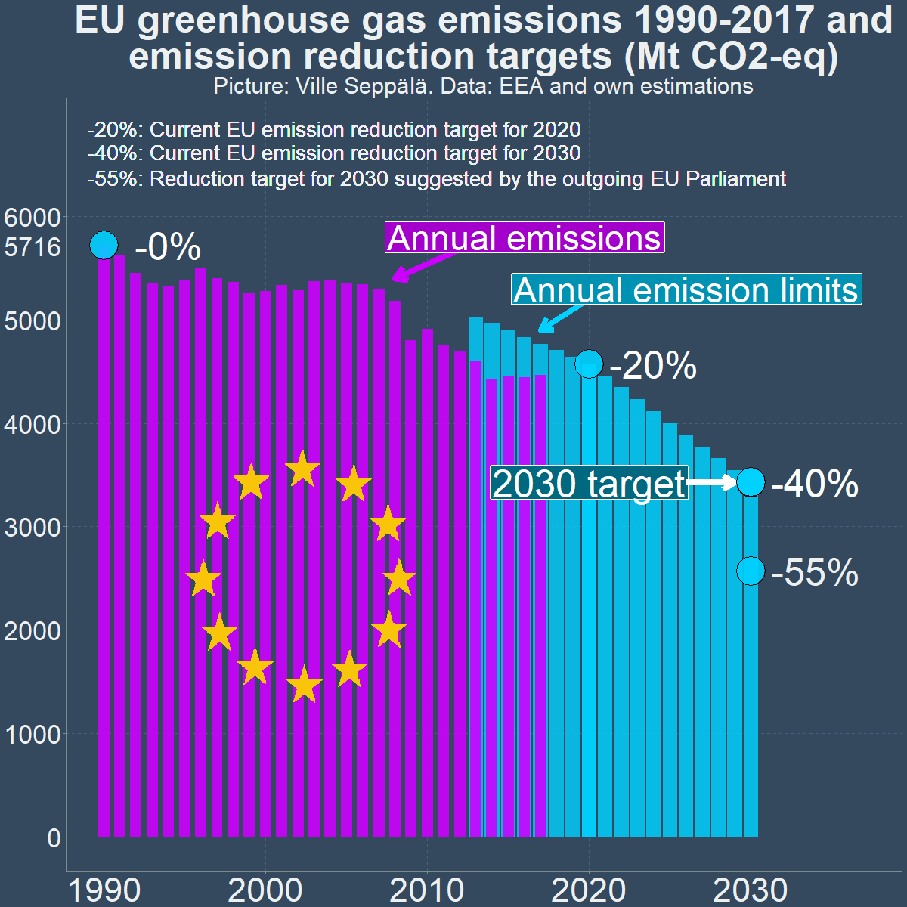
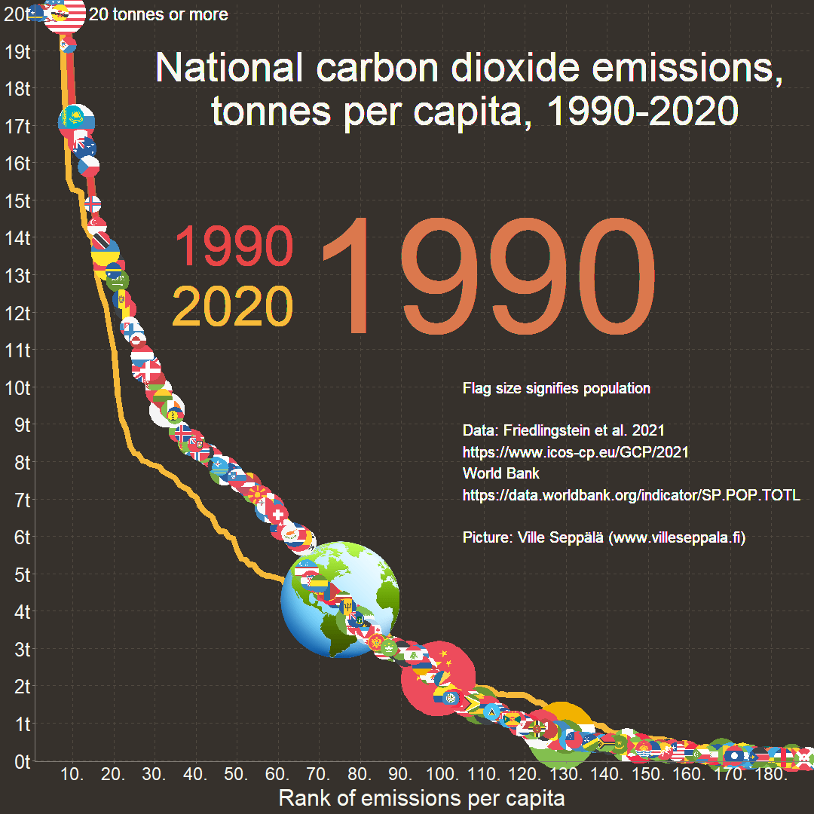
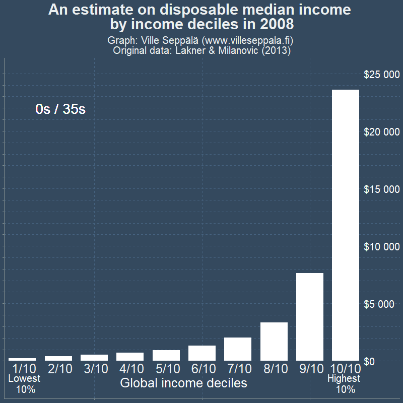

## Projekti ja sen motivaatio

### Tavoite ja toteutus

Haluan toteuttaa yhteispituudeltaan noin 1-2 tunnin mittaisen videosarjan hiilen hinnoittelusta merkittävänä ja tehokkaana keinona ilmastonmuutoksen torjumisessa. Projektissa yhdistetään taloustieteellistä näkökulmaa audiovisuaaliseen tarinankerrontaan ja tosimaailman esimerkkeihin.

Videot koostuisivat pääosin animaatioista ja infografiikoista sekä äänikerronnasta. Videoissa pyritään välttämään tavanomaista "puhuva pää" -toteutustapaa ja hyödyntämään "kuva kertoo enemmän kuin tuhat" -periaatetta. Videot onkin tarkoitus pitää kiinnostavana juuri tiheällä tietomäärällä ja hyvällä visuaalisella toteutuksella. Lue videoiden sisällöstä "Luonnos videosarjan sisällöstä" -osiosta.

Videot toteutaan suomeksi ja englanniksi. Englanninkielisesta versiosta jätetään pois Suomi-spesifejä osioita. Koodipohjainen, etenkin R-ohjelmointikielellä, toteutettu video mahdollistaa samojen animaatio- ja graafikoodien käyttämisen eri kieliversioissa, siten että vain niiden tekstiä/ääntä tulee muuttaa.

Videot ladattaisiin Youtubeen ja mahdollisesti joihinkin muihin videopalveluihin (Vimeo yms). Niistä voidaan myös tehdä lyhyitä teasereita somepalveluissa jaettavaksi.

Hankkeen kesto olisi n. 9-12 kuukautta n. 75% osa-aikaisella työajalla.

### Motivaatio

Minua motivoivat videosarjan toteuttamiseen muun muassa nämä tekijät:

-   Ilmastonmuutoksesta ylipäätään ei ole nähdäkseni ole juurikaan houkuttelevasti tuotettua kotimaista videosisältöä. Kansainvälisesti laadukasta sisältöä on paljon, mutta siinäkin päästöhinnoitteluun keskittyvistä videoista on puute.
-   Päästöhinnoittelun tehokkuutta ei välttämättä sisäistetä, ja siitä viestiminen on siksi tärkeää. Päästöhinnoittelua pidetään etenkin taloustieteilijöiden keskuudessa hyvin tehokkaana päästövähennyskeinona, ja videoiden yksi keskeinen tarkoitus on kansantajuistaa aihetta.
-   Nykyisen päästöhinnoittelun mittakaavaa on hankala hahmottaa. Esimerikksi päästökaupan päästöoikeuksin hinta (nyt noin 80 euroa per tonni) ei kerro paljoa, kun tonnimäärät eivät välttämättä tuttuja, saati että kuinka suurta/pientä osaa päästöistä päästökauppa koskee. Sama kotimaisten päästöverojen osalta.
-   Uskon, että moni yliarvioi päästöhinnoittelusta itselleen koituvat kustannukset tai aliarvioi niistä saatavat tulot verojen ja muiden maksujen muodossa. Toisaalta osalla saattaa olla liiankin positiivinen näkymä hiilen hinnoittelun kaikkivoipaisuudesta. Videosarjassa tuodaan esiin myös sen heikkouksia.
-   Videoiden on tarkoitus olla pääosin yleismaailmallisia ja ajasta riippumattomia, mutta jossain määrin on hyödyllistä kytkeä niitä myös nykyiseen ilmastopolitiikkaan etenkin Suomessa ja EU:ssa.

## Pätevyyteni projektiin

CV: <https://villeseppala.wordpress.com/cv/>

Muut tämänhetkiset kiinnostukseni: [https://villeseppala.github.io/interests/](https://villeseppala.github.io/interests/#901)

### Työ- ja vapaaehtoiskokemus

Minulla on tohtorintutkinto taloustieteestä, mikä auttaa ymmärtämään hiilen hinnoittelun teoreettista taustaa.

Olen työskennellyt ilmastonmuutos-teeman parissa aiemmin:

-   Valtiontalouden tarkastusvirasto marraskuu 2023-joulukuu 2025. Ilmastonmuutoksen tietoperustan tarkastus, joka kesti koko määräaikaisuuteni ajan. Tarkastuksessa arvioitiin, että saavatko päättäjät tarpeeksi tietoja päästövähennystoimien vaikuttavuudesta ministeriöistä heidän valmistellessaan ilmastopolitiikan suunnitelmai. Olin tarkastuksessa johtava tarkastaja.

-   Euroopan parlamentin tutkijapalveluiden työllistämänä ajoittain vuodesta 2020 alkaen. Olen tehnyt graafeja jäsenmaiden ilmastotilastoista etenkin europarlamentaarikkojen käyttöön tuleviin raportteihin.

-   Apurahatyöntekijänä Koneen säätiön apurahalla vuosien 2022 ja 2023 vaihteessa. Tein sovellus globaalin hiilen hinnoittelun ja hiiliosingon tulonjakovaikutuksista: <https://globalcarbonprice.com/>

-   Olen myös ollut Vihreiden ilmasto- ja energiatyöryhmän jäsenenenä vuodesta 2021 alkaen.

### Tekninen osaaminen ja aiempi tuotanto

Videot toteutetaan R-ohjelmointikielellä ja sen laajennuksilla. Olen aiemmin tehnyt dashboard-sovelluksia shiny-laajennuksella (mm. yllä mainittu globalcarbonprice.com) ja animaatioita gganimate-laajennuksella. Sekä animaatioissa, dashboardeissa että myös staattisten kuvien teossa (esim. yllä mainitut EPRS:lle tuotetut kuvat) olen hyödyntänyt ggplot2-laajennusta graafien luomisessa.

Muutama esimerkki animaatioista, joita olen tehnyt aiemmin:

Portfolio-linkin takana esimerkkejä myös tekemistäni kuvista: <https://villeseppala.github.io/interests/portfolio>

Olen tehnyt aiemmin ilmastonmuutos-aiheisia videoita youtube-kanavalleni omalla ajallani, tässä ehkä tärkeimmät:











Videoiden toteuttamisesta on vuosia aikaa. Minulla on nyt parempi tietotaso ja tekninen osaaminen siihen verrattuna. Tavoitteena on yhdistää animaatioita videoihin paremmin, ja tehdä kerronnasta siten houkuttelevampaa ja soljuvampaa.

Minulla on käytössäni studiotasoinen mikrofoni hyvän äänenlaadun varmistamiseksi. Englanninkielisten videoiden äänen toteuttamiseen palkkaan todennäköisesti ääninäyttelijän osana apurahan käyttöä.

## Luonnos videosarjan sisällöstä

Alla hyvin varhainen jaottelu tällä hetkellä mielessä olevista yksittäisistä aiheista. Nämä voisivat olla erillisiä videoita, tai niitä voitaisiin yhdistää yhdeksi tai useammaksi videoksi. Aiheita tulee myös varmasti mieleen lisää.

### Yleiskatsaus videosarjaan

Lyhyt esittelyvideo, jossa käydään läpi videosarjan motivaatio, tavoitteet ja sisältö tiivistettynä

### Mitä hiilen hinnoittelu on ja mikä on hiilen hinnan ja päästöjen suhde?

-   Esitellään haittaverojen/haittamaksujen (Pigouvian taxes) konseptia yleisesti, esimerkkeinä esim. alkoholi- ja tupakkaverotus, joka on yleistä ympäri maailmaa. Tuo esiin haittaverojen normaaliutta.

-   Hiilen hinnoittelun tyyppejä: päästökauppa, hiilivero, hiilitullit. Käydään läpi päästökauppaa ja hiiliveroa toistensa kääntöpuolina. Hiiliverossa asetetaan hinta ja päästöjen määrä seuraa siitä - päästökaupassa asetetaan päästöjen määrä, ja hiilen hinta seuraa siitä. Periaatteessa eri hinta- ja päästötasojen yhteyden tulisi pysyä samana päästöhinnoittelun toteutustavasta riippumatta.

-   Visualisaoidaan päästövähennystoimien rajakustannuskäyrää (Marginal abatement curve (MAC)) suhteessa hiilen hintaan tai päästötavoitteeseen osoittamaan tasapainon muodostumista hiiliveron tai päästökaupan tapauksessa.

(Jako: päästöhinnoittelu yritysten tasolla ja yksilöiden tasolla. Kummankin heikkoudet samaan. Yrityksen osalta tuotekehitys)

### Hiilen hinnoittelu näkymättömänä mutta tehokkaana yleispäästövähennystoimena yhteiskunnan ja yksilön tasolla

-   Jatketaan rajakustannusäyrän kanssa ja katsotaan sitä yksityiskohtaisesti eri esimerkkipäästövähennystoimien osalta. Tuodaan esiin miksi päästöhinnoittelu on kustannustehokkaampaa kuin yksittäisten toimien valinta, mikäli halutaan osoittaa päästövähennyksiin tietty määrä resursseja tai mikäli tavoitellaan jotain tiettyä päästötasoa. Tämä etenkin siinä tapauksessa, että päästövähennystoimien hinta on epätäydellisesti tutkijoiden tai päättäjien tiedossa, mikä on hyvin realistinen tilanne. Hiilen hinnan hienous on, että kenenkään ei keskitetysti tarvitse tietää halvimpia päästövähennystoimia, vaan hintasignaali ohjaa kaikkia niitä tunnistavia automaattisesti.

-   Tuodaan esiin miksi tämä pätee myös pienemmässä skaalassa, yritysten ja yksilöiden käytöksen tasolla. Esimerkiksi polttoaineiden kallistuminen päästöhinnoittelun seurauksena voi johtaa hyvin erilaisiin valintoihin yrityksestä riippuen, se mikä on millekin yrityksille edullisinta voi vaihdella huomattavasti.

-   Myös yksilö voi valita, että mistä päästölähteistä juuri hänen on helpoin vähentää tai minkä ylläpidosta on valmis maksamaan. Sen sijaan että kiellettäisiin joko lentomatkat tai lihansyönti, niin päästöverolla voidaan päästä samaan kokonaisvähennykseen siten että siitä koituu yksilöille kokonaisuutena pienempi haitta, koska se säilyttää yksilöillä valinnanvaraa.

-   Yksilöille valtaosa on kuitenkin näkymätöntä, kun esimerkiksi käytössä oleva sähkö tai lämpö muuttuu automaattisesti.

### Hinnoittelun positiivinen dynamiikka

(Tämä osio yhdistetään luultavasti johonkin toiseen, mutta en ole vielä varma mihin)

-   Päästöhinnoittelu edistää vähäpäästöisten ratkaisujen käyttöönottoa. Tämä lisää niiden mittakaavaetuja ja ylipäätään panostusta niiden kehittämiseen. Tämä tekee niiden käytön edullisemmaksi ja kilpailukykyisemmäksi suhteessa korkeapäästöisiin ratkaisuihin, jolloin ei tarvita yhtä korkeaa hiilen hintaa saman päästötason saavuttamiseen kuin ns. staattisessa mallissa, tai kääntäen: tietyllä hintatasolla saavutetaan staattista mallia matalammat päästöt. Tämän positiivisen noidankehän vaikutus voi olla kohtalaisen suuri. Nostetaan tässä esimerkkinä ainakin aurinko- ja tuulivoiman hintatason tippuminen niiden tuotannon kasvaessa. EU:n päästöhinnoittelu ollut osin auttamassa.

### Synergioita ja vajeita, eli miksi tarvitaan muutankin kuin hiilen hinnoittelua?

-   Teknologian kehittymisellä on ollut iso rooli päästövähennyksissä. Monessa tapauksessa voi olla hyödyllistä ohjata taloudellista tukea teknologiakehitykseen tai demonstraatiohankkeisiin verrattuna siihen, että sama kehitys saavutetaan pääästöhinnoittelulla.

-   Ns. Lumipalloefekti voi vaatia alkutuuppausta, jos hintasignaali ei saa tarpeeksi muutosta aikaan, vaikka olisi se riittäisi ns. tasapainotilan mukaisesti. Esimerkiksi sähköautojen yleistymisessä tärkeää on ollut latausverkkojen kehitys. Kohdistettu tuki ensimmäisten latureiden rakentamiseen sai monet hankkimaan sähköauton, mikä on sitten tehnyt latureiden rakentamisen markkinaehtoisesti kannattavaksi yhdessä esim. polttoaineiden hiiliveron kanssa.

-   Esimerkiksi elintarvikkeiden osalta voi olla hankaluuksia päästöjen mittaamisessa. Onko hiilen hinnoittelu paras tapa?

-   Kaiken kaikkiaan hiilen hinnoittelu hyötyy synergioista joidenkin kohdistettujen päästötoimien kanssa, ja joskus on järkevä hyödyntää muitakin ratkaisuja.

### Miten korkea hiilen hinnan tulisi olla?

\- Katsotaan eri läheystymistapoja:

-   Päästötavoitteeseen vaadittava hiilen hinta. Asetetaan tavoite, esimerkiksi globaalilla tasolla 2 asteen lämpenemisen alla pysyminen tai Suomen tasolla 2035-hiilineutraaliustavoite. Asetataan hiilen hinta riittävän korkeaksi (yhdessä mahdollisten muiden toimien kanssa), että päästötavoitteeseen päästään. Päästökaupan kautta toteutettuna hiilen hinta

-   Hiilen hinnoittelun haittojen (taloudellisten kustannusten kasvu, kilpailukykyhaitat) ja hyötyjen tasapainon mukainen hinta = Rajakustannuskäyrän ja rajahyötykäyrän leikkauspiste. Molempia on toki hankala arvioida. Käydään läpi Social Cost of Carbon -konseptia ja -arvioita ja suhteutetaan niitä nykyisiin päästöhintoihin. SCC pyrkii euromääräistämään lisäisen päästötonnin haitan - optimissa hiilen hinta asetetaan vastaamaan tuota lukua.

### Keihin hiilen hinnoittelun haitat ja hyödyt kohdistuvat eniten?

Hiilen hinnoittelun vaikutusten kohdistuminen on melko moniulotteinen teema.

-   Hiilen hinnoittelu ei erottele päästölähteitä välttämättömyys-luksus-skaalalla tai päästölähteiden muita haittoja huomioiden. Intuition mukaan esimerkiksi lentomatkojen päästöihin olisi reilua kohdistaa enemmän vähennyspainetta kuin lämmityksen päästöihin.

-   Onko haittaverojen vaikutus hyvätuloisten käytökseen vähäisempää? Miten suurta ohjausvaikutus on eri tuloluokissa?

-   Ovatko haittaverot luonteeltaan regressiivisiä vai progressiivisia, eli kohdistuvatko ne tulotasoon suhteutettuna enemmän pieni- vai suurituloisiin? Miten tämä eroaa tarkasteltaessa globaalisti ja Suomen tasolla? Miten paljon esimerkiksi sähköautoistuminen on muuttanut tilannetta, jos hyvätuloisimmilla on paremmat mahdollisuudet sähköautojen hankintaan?

-   Voidaanko tulonsiirroilla (esim. hiiliosinko tai EU:n sosiaalinen ilmastorahasto) lievittää mahdollisia tulonjakohaittoja? Mihin päästöhinnoittelun tulot menevät nyt ja miten se vaikuttaa tulonjakoon?

-   Hiilen hinnoittelun heikkous veronkeruutapana on, että veropohja murenee sitä mukaa kun hinnoittelu edistää päästöjen vähentämistä. Suomessa ajankohtaista etenkin liikenteen verotuksen osalta. Heikentää mahdollisuuksia ohjata verotuloja pienituloisille.

-   Edelliseen liittyen esitellään verotuksen hyvinvointitappio (deadweight loss of taxation) eli miksi verotus ei ole yhteiskunnan tulojen kannalta nollasummapeliä, vaan vähentää taloudellista toimeliaisuutta ja kulutusta, kun verotettava toiminta väheneee - hiilen hinnoittelun tapauksessa tämän vähenemisen haittaa tulee tasapainottaa sen hyötyyn, eli ilmastonmuutoksen torjuntaan.

### EU:n päästökauppajärjestelmä(t)

-   Käydään läpi EU:n päästökauppajärjestelmää yleisestä tasosta (päästökaupan perusperiaatteet) yksityiskohtaisempaan tasoon, ja päästökaupan viimeaikaisiin ja ehdotettuihin muutoksiin.

-   Suomi EU:n päästökauppajärjestelmän hyötyjänä. Teollisuus ja energiamarkkinat vähentäneet paljon päästöjään. Päästöoikeustulot hyvin vanhojen päästöjen perusteella, joten olemme nettohyötyjiä (ainakin ilman deadweight lossin huomioimista).

-   Liikenteen ja lämmityksen päästökauppa (ETS-2) alkamassa EU:ssa. Se on on herättänyt vastustusta, ja tulee herättämään vielä enemmän, kun se lopulta käynnistyy. Jäydään läpi järjestelmää. EU:ssa on myös käynnissä ehdotuksia "alkuperäisen" päästökaupan (ETS-1) lieventämiselle eri tavoin. ETS-1:n lieventämisen kohdalla ei välttämättä sisäistetä, että se vähentää myös EU:n hiilirajamekanimista saatavia tuloja.

### EU ja kansalliset päästöyksiköt

Tämä osio yhdistetään mahdollisesti sivumaininnaksi edelliseen. Voidaan jättää kokonaan välistä, jos vaikuttaa että järjestelmä ei ole käytössä kaudella 2030-2040.

-   EU:ssa on ollut käynnissä järjestelmä, jossa jäsenmaat voivat hankkia toisiltaan päästöyksiköitä taakanjako- ja maankäyttösektoreilla päästötavoitteissa pysymiseksi
-   Kirjoitin aiheesta osana VTV:n syksyn 2025 finanssipolitiikan valvonnan raporttia, sivu 77 alkaen: <https://vtv.fi/raportti/finanssipolitiikan-valvonnan-raportti-2025/>
-   Järjestelmä tuntuu olevan heikosti tiedossa. Se voi kuitenkin tehostaa päästövähennysten kustannustehokasta jakaantumista jäsenmaiden välillä. Päästöyksiköiden hinta voi toimia signaalina jäsenmaiden hiiliverojen tasolle.

### Globaali hiilen hinnoittelu - tilanne ja mahdollisuudet

-   Käydään läpi hiilen hinnoittelun kehitystä ja tilannetta globaalissa mittakaavassa. Miten suuri osa maista on omaksunut hiilen hinnoittelun jossain muodossa, ja miten hiilen hintataso on keskimäärin kehittynyt?

-   Miten globaali päästöhinnoittelua yritetään edistää tai voisi edistää. EU:n hiilitullit eli hiilirajamekanismi (CBAM, Carbon Border Adjustment Mechanism) osana tätä. CBAM voidaan esitellä myös päästökauppa-videossa.

-   Suomi yhtenä globaalin hiilen hinnoittelun selkeistä edunsaajista. Päästöt/BKT-suhteemme on maailman matalimpia, joten haitta taloudellemme olisi huomattavan pieni, ja kilpailukykyknäkökulmasta olisimme voittajia.

-   Globaali hiilen hinnoittelun ja hiiliosingon tulonjakovaikutukset. Käydään läpi <https://globalcarbonprice.com/> -sivuni kautta. Osa projektista käytettääisiin sivuston tekemiseen soljuvammaksi. Keskimäärin köyhimmät voittaisivat, koska heillä keskimäärin pienimmät päästöt. Tämä ei huomioi deadweight lossia, mutta senkin kanssa varmaan pätee. Katsotaan potentiaalisia tulonjakovaikutuksia eri päästötavoitteilla, niihin vaadittavilla hillen hinnoilla,